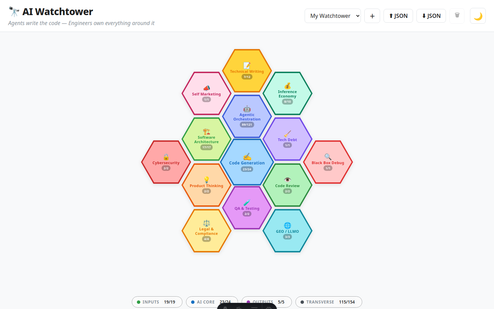

# 🔭 AI Watchtower



Interactive tech radar for AI-augmented software engineering. Spot what matters, track what you've read, build your own template for a career path, project, or mission.

## 🚀 Run locally

**Requires [Node.js](https://nodejs.org/) ≥ 22.12.0**

```bash
git clone https://github.com/fdelbrayelle/ai-watchtower.git
cd ai-watchtower/web
npm install
npm run dev        # → http://localhost:4321
```

> `npm run dev` and `npm run build` automatically re-extract all resources from this README — add a link here and it appears in the app on next run.

## ☁️ Deploy to Vercel

Import the repo in [Vercel](https://vercel.com), set **Root Directory** to `web`, and deploy. Every push to `main` rebuilds and redeploys automatically.

---

Software engineering was never just about writing code — and the agentic era makes that clearer than ever. Architecture, product thinking, code review, testing strategy, technical writing: these skills now define the engineer's value more than keystrokes ever did.

**The Software Engineer is becoming a Product Engineer.** When agents handle execution, the engineer's critical value shifts to the decisions surrounding the code: upstream (what to build, why, for whom, with what constraints) and downstream (is it correct, secure, maintainable, observable?). This is governance and judgment — scoping requirements, choosing trade-offs, validating outputs, and owning outcomes end to end. The title may stay the same, but the job description is now that of a product engineer in the broadest sense.

**Vibe Coding vs. AI-Augmented Software Engineering** — Vibe coding means describing what you want in natural language and letting the AI generate the result with minimal oversight — fast, creative, great for prototypes and throwaway scripts. AI-augmented software engineering is the opposite mindset: the engineer stays in the driver's seat, using AI to accelerate exploration, drafting, and iteration while retaining full responsibility for architecture, correctness, and maintainability. This radar focuses on the latter. The goal is not to remove the engineer from the loop, but to make the loop faster and the engineer more effective.

**AI will transform jobs — and create new ones.** Yes, AI will destroy certain jobs. But more precisely, it will transform them — and create entirely new roles that don't exist yet, just as the smartphone revolution created "mobile developer," "growth hacker," and "UX researcher" — jobs no one imagined in 2001. This is [Schumpeterian growth](https://en.wikipedia.org/wiki/Schumpeterian_growth) in action: innovation destroys the old to make room for the new. Joseph Schumpeter called it [creative destruction](https://en.wikipedia.org/wiki/Creative_destruction) — the engine of capitalism where obsolete industries, skills, and roles are continuously replaced by more productive ones. AI prompt engineers, agent orchestrators, AI auditors, and synthetic data curators are early examples. The net effect on employment depends on how fast we adapt, retrain, and build the new ecosystem.

**But we're not there yet — real-world constraints slow the revolution:**
- **Energy:** Training and running frontier models demands staggering compute power. Each major AI datacenter [requires near-dedicated nuclear plant capacity](https://www.iea.org/reports/energy-and-ai) — a direct collision course with climate and energy crises.
- **Adoption is still niche:** As of 2025, only [~23% of U.S. adults](https://www.pewresearch.org/short-reads/2024/10/23/how-americans-view-ai/) have used ChatGPT, and [65% of organizations](https://www.mckinsey.com/capabilities/quantumblack/our-insights/the-state-of-ai) report using generative AI regularly — but intensive, agentic usage remains a tiny fraction of 8+ billion humans. Early adopters are not the norm. 84% of humanity has never used AI. [This chart](docs/ai-adoption-dots-chart.jpg) (February 2026 data) shows 8.1 billion people as dots — each dot represents 3.2 million humans. The grey fills almost the entire frame. If you've ever used ChatGPT, even once, you're among the 16% who've tried AI at all. If you pay $20/month for it, you're in the top 0.3%. If you use AI for coding, you're in the top 0.04%.
- **High-potential sectors lag behind:** The legal sector, despite being one of the most automatable knowledge domains, reports only [~35% of lawyers using AI in practice](https://www.americanbar.org/groups/law_practice/resources/tech-report/) (ABA 2024 TechReport). Medicine, education, and government show similar gaps.
- **Regulation divergence:** Europe is regulating aggressively with the [EU AI Act](#legal-compliance--governance), which risks constraining innovation. Meanwhile, the US and China are racing toward AGI with lighter guardrails — creating a global asymmetry in AI capability and deployment.

This is a curated tech radar for AI-augmented software engineering. Tools, frameworks, protocols, methodologies, and best practices — one place to track what matters when AI writes the code and you own everything around it.

📌 = Unread

---

<a id="what-to-focus-on-now"></a>

## 🎯 What to Focus On Now

With 80%+ of code now AI-generated, the engineer's value shifts from writing code to shaping what gets built, how it holds together, and whether it works.

**Inputs — What you shape before the agent writes code:**

- [Product Thinking](#product-thinking) — Own the "what" and "why" before the agent writes the "how"
- [Software Architecture](#software-architecture) — The "how": system design, boundaries, and trade-offs that agents can't decide alone

**Outputs — What you verify after the agent writes code:**

- [Code Generation / Writing](#code-generation--writing) — AI writes 80%+ of the code; your 20% is where judgment, edge cases, and craft still matter
- [Technical Debt Management](#technical-debt-management) — AI writes fast, but someone has to maintain it
- [Code Review](#code-review) — The last line of defense is now the main job
- [QA & Testing Strategy](#qa--testing-strategy) — If you didn't write it, you'd better know how to break it

**Transverse — Skills that apply across the entire lifecycle:**

- [Self Marketing](#self-marketing) — Build visibility on LinkedIn, Twitter/X, Slack, and beyond — your work won't speak for itself
- [GEO / LLMO](#geo--llmo) — Marketing outcomes where AI models can find them
- [Technical Writing](#technical-writing) — Specs, prompts, and docs are the new source code
- [Agentic Orchestration](#agentic-orchestration) — Designing, chaining, and supervising AI agents (see below 👇)
- [Inference Economy](#inference-economy) — Save tokens, script repetitive tasks, run local models for privacy and offline work
- [Black Box Debug & Observability](#black-box-debug--observability) — You can't debug what you can't see; instrument what agents produce
- [Legal, Compliance & Governance](#legal-compliance--governance) — GDPR, AI Act, licensing — the rules AI can't learn on its own
- [Cybersecurity](#cybersecurity) — AI-generated code is only as secure as the reviewer

**⚠️ Bottlenecks — Where the pipeline stalls:**

- **Upstream:** Product must feed the backlog with clear business needs and prioritized requests — without this, agents spin on low-value work. FOMO-driven adoption ("competitors are shipping faster") compounds the problem by flooding the pipeline with half-baked specs.
- **Downstream:** The human review layer can't scale at the same pace as AI output. Code review and QA fatigue set in fast. It's hard to say "stop" to agentic work at end of day. Constant context switching erodes focus, developers lose meaning in the work, and the risk of burnout becomes real. Mario Zechner makes the case for [slowing the fuck down](https://mariozechner.at/posts/2026-03-25-thoughts-on-slowing-the-fuck-down/) — autonomous agents create brittle systems with compounding errors; keep humans in control of architecture, use agents only for scoped evaluable tasks.

The radar below tracks the tools and practices for each of these areas.

---

<a id="product-thinking"></a>

## 💡 Product Thinking

Own the "what" and "why" before the agent writes the "how".

- [Product Manager Roadmap](https://roadmap.sh/product-manager) — Roadmap for product managers
- [Thiga Books & Assets](https://www.thiga.co/en/our-assets) — Product management books and resources by Thiga
- [Agent-First Product Engineering](https://posthog.com/newsletter/agent-first-product-engineering) — PostHog on how product engineering shifts when AI agents are first-class actors in the development process
- [What is a Product Engineer?](https://posthog.com/product-engineer/what-is-a-product-engineer) — PostHog's definition and role breakdown for product engineers 📌 Unread

### The Product Manager Role

The PM is the bridge between **Business** (company objectives), **UX/Design** (user needs), and **Technology** (feasibility). Not a decision dictator — an alignment enabler who ensures the team builds the right thing, for the right user, at the right time.

**Core missions:**
- **Discovery** — Understand user problems via interviews, data analysis, and competitive research
- **Strategy** — Define the product vision and prioritize for maximum impact
- **Delivery** — Partner with devs and designers to ship concrete features
- **Analysis** — Track KPIs post-launch and adjust course

**Key deliverables by phase:**

*Strategy & Vision*

<table style="width:100%"><thead><tr><th width="50%">Deliverable</th><th width="50%">Purpose</th></tr></thead><tbody>
<tr><td>Product Vision Board</td><td>Product intent, target audience, and value proposition</td></tr>
<tr><td>Product Roadmap</td><td>Macro view (often quarterly) of upcoming features and themes</td></tr>
<tr><td>KPI Dashboard</td><td>Track performance (retention, conversion, etc.)</td></tr>
</tbody></table>

*Discovery & Design*

<table style="width:100%"><thead><tr><th width="50%">Deliverable</th><th width="50%">Purpose</th></tr></thead><tbody>
<tr><td>Personas</td><td>Profiles of target users and their pain points</td></tr>
<tr><td>PRD (Product Requirements Document)</td><td>The "Why" and "What" of a feature before development starts</td></tr>
<tr><td>User Journey / Story Map</td><td>Map of the user's path through the product</td></tr>
</tbody></table>

*Delivery*

<table style="width:100%"><thead><tr><th width="50%">Deliverable</th><th width="50%">Purpose</th></tr></thead><tbody>
<tr><td>Backlog</td><td>Ordered list of all remaining tasks and features</td></tr>
<tr><td>User Stories</td><td>"As a [user], I want [action] so that [benefit]"</td></tr>
<tr><td>Release Notes</td><td>Internal/external communication on what shipped</td></tr>
</tbody></table>

> The PM never works alone — wireframes involve the Product Designer, feasibility involves the Lead Tech. The PM's job is to keep the whole coherent.

---

<a id="software-architecture"></a>

## 🏗️ Software Architecture

The "how" that shapes what the agent builds — system design, boundaries, and trade-offs that can't be delegated to a prompt.

- [Software Architect Roadmap](https://roadmap.sh/software-architect) — Roadmap for software architects
- 📚 [**Designing Data-Intensive Applications**, 2nd Edition](https://www.oreilly.com/library/view/designing-data-intensive-applications/9781098119058/) (book) — Martin Kleppmann, Chris Riccomini — Distributed systems, data models, storage engines, and trade-offs at scale

### Data Engineering & Science

Roadmaps, machine learning, and data career paths.

**AI is the umbrella — not the model.** Artificial Intelligence encompasses Machine Learning (ML), which encompasses Deep Learning (DL), which encompasses the specific model architectures we use today: SLMs (Small Language Models), LLMs (Large Language Models), vision models, etc. LLMs are built on the [**attention mechanism**](https://en.wikipedia.org/wiki/Attention_Is_All_You_Need) introduced in *Attention Is All You Need* (Vaswani et al., 2017), which uses learned weights to let the model focus on relevant parts of the input — the foundation of the Transformer architecture. Agents don't *replace* any of these layers — they *orchestrate* them, chaining models, tools, and memory into goal-driven workflows. Understanding this hierarchy matters: not every problem needs a frontier LLM, and not every AI system is an agent.

- 📌 📚 [**AI Engineering**](https://www.oreilly.com/library/view/ai-engineering/9781098166298/) (book) — Chip Huyen — Building production AI-powered applications with foundation models: evaluation, RAG, fine-tuning, and deployment
- 📚 [**Fundamentals of Data Engineering**](https://www.oreilly.com/library/view/fundamentals-of-data/9781098108298/) (book) — Joe Reis, Matt Housley — Data pipelines, storage, ingestion, orchestration, and the data engineering lifecycle
- 📚 [**Machine Learning avec Scikit-Learn**](https://www.oreilly.com/library/view/machine-learning-avec/9782100797820/) (book) — Aurélien Géron — Hands-on ML with Scikit-Learn
- 📚 [**Deep Learning avec Keras et TensorFlow**](https://www.oreilly.com/library/view/deep-learning-avec/9782100805020/) (book) — Aurélien Géron — Deep learning with Keras and TensorFlow

#### Roadmaps

- [Data Engineer Roadmap](https://roadmap.sh/data-engineer)
- [Data Analyst Roadmap](https://roadmap.sh/data-analyst)
- [SQL Roadmap](https://roadmap.sh/sql)
- [Machine Learning Roadmap](https://roadmap.sh/machine-learning)
- [AI Data Scientist Roadmap](https://roadmap.sh/ai-data-scientist)
- [AI Engineer Roadmap](https://roadmap.sh/ai-engineer)
- [AI Agents Roadmap](https://roadmap.sh/ai-agents)
- [MLOps Roadmap](https://roadmap.sh/mlops)

#### Basic Maths for AI

Understanding AI under the hood requires two pillars: **linear algebra** and **probability/statistics**.

**Linear algebra** is the language of data. Every dataset is a matrix, every feature is a vector, and every model transformation (rotation, scaling, projection) is a matrix operation.

A **vector** is a list of numbers representing a point or direction in space. In AI, vectors are everywhere: a word embedding like `[0.2, -0.5, 0.8]` places a word in a 3D semantic space. Similar words end up as nearby vectors — "king" and "queen" are close, "king" and "banana" are far. This is how models understand meaning: not through definitions, but through geometric proximity. Real embeddings use hundreds of dimensions (e.g., OpenAI's `text-embedding-3-small` produces 1536-dimensional vectors), but the principle is the same. The **dot product** of two vectors measures their alignment: high dot product = similar direction = similar meaning. This is the core operation behind cosine similarity in vector search (RAG, recommendation systems) and attention scores in transformers. **Vector addition** enables analogies: the classic `king - man + woman ≈ queen` works because semantic relationships are encoded as directional offsets in vector space.

Key concepts beyond vectors: matrix multiplication (the core of neural network forward passes — each layer is a matrix multiply + activation), eigenvalues/eigenvectors (behind PCA dimensionality reduction), and tensor operations (multi-dimensional arrays powering deep learning frameworks like PyTorch and TensorFlow). Example: when a transformer model computes attention scores, it's performing `softmax(QK^T / √d) × V` — pure matrix math.

**Probability & statistics** drive how models learn and predict. Key concepts: Bayes' theorem (the foundation of updating beliefs with evidence — spam filters, medical diagnosis), probability distributions (normal, Bernoulli, softmax outputs), conditional probability (P(A|B) — "given this input, what's the likely output?"), maximum likelihood estimation (how models fit parameters to data), loss functions and gradient descent (cross-entropy, MSE — measuring and minimizing prediction error). Example: a language model predicting the next token is outputting a probability distribution over the entire vocabulary, trained by minimizing cross-entropy loss.

- 📚 **Essential Math for Data Science** (book) — Mathematical foundations
- 🎥 [3Blue1Brown: Essence of Linear Algebra](https://www.youtube.com/playlist?list=PLZHQObOWTQDPD3MizzM2xVFitgF8hE_ab) — Visual, intuitive linear algebra series
- 🎥 [StatQuest: Statistics Fundamentals](https://www.youtube.com/playlist?list=PLblh5JKOoLUK0FLuzwntyYI10UQFUhsY9) — Statistics and ML concepts explained clearly
- 🎥 [MachineLearnia](https://www.youtube.com/@MachineLearnia) — Machine Learning and Deep Learning video course

#### Learning

- [Clean & Analyze Your Dataset](https://openclassrooms.com/fr/courses/7410486-nettoyez-et-analysez-votre-jeu-de-donnees) — OpenClassrooms data cleaning course
- **Tools**: Jupyter Notebook, Kaggle, Hugging Face, Matplotlib, NumPy, Pandas

---

<a id="code-generation--writing"></a>

## ✍️ Code Generation / Writing

AI writes 80%+ of the code, but the software engineer can still have added value on up to 20% of code writing on their own — judgment calls, edge cases, glue code, and craft that agents miss.

### Language Ecosystems

AI-era tooling and best practices for Java and Python.

#### AI for Java

Spring AI, LangChain4J, and the Java AI ecosystem.

- [Spring AI](https://spring.io/projects/spring-ai) — Official Spring AI project
- [Spring AI Concepts](https://docs.spring.io/spring-ai/reference/concepts.html) — Core concepts documentation
- [LangChain4J](https://docs.langchain4j.dev/) — Java LLM framework documentation
- [LangChain4J + Docker Model Runner](https://medium.com/@lize.raes/langchain4j-%EF%B8%8F-docker-model-runner-b5f720a76c85) — Running LangChain4J with Docker
- [Evolution of the Java Ecosystem for AI](https://inside.java/2025/01/29/evolution-of-java-ecosystem-for-integrating-ai/) — Oracle's perspective on Java + AI
- [Koog for Java](https://blog.jetbrains.com/ai/2026/03/koog-comes-to-java/) — JetBrains' AI framework for Java 📌 Unread

#### Python Ecosystem

Python fundamentals, frameworks, and best practices for the AI-era developer.

##### Core Python

- [PEP 8 — Style Guide](https://peps.python.org/pep-0008/) — The official Python style guide
- [Python Standard Library](https://docs.python.org/3/library/) — Complete standard library reference
- [Virtual Environments (venv)](https://docs.python.org/3/library/venv.html) — Managing Python environments
- [Classes & Namespaces](https://docs.python.org/3/tutorial/classes.html#python-scopes-and-namespaces) — Scopes and namespaces tutorial
- [Dunder Methods](https://gayerie.dev/docs/python/python3/dunder.html) — Guide to Python magic methods
- [Abstract Base Classes (abc)](https://docs.python.org/fr/3.13/library/abc.html) — ABC module reference
- [AsyncIO](https://docs.python.org/fr/3.13/library/asyncio.html) — Asynchronous I/O reference
- [Dataclasses](https://invivoo.com/blog/dataclasses-python) — Practical guide to dataclasses
- [Dependency Injection Best Practices](https://arjancodes.com/blog/python-dependency-injection-best-practices/) — DI patterns in Python
- [DDD with Python Microservices](https://medium.com/@nomannayeem/everything-you-need-to-know-about-domain-driven-design-with-python-microservices-2c2f6556b5b1) — Domain-Driven Design guide
- [Is Python Really That Slow?](https://blog.miguelgrinberg.com/post/is-python-really-that-slow) — Performance myths debunked
- [Python Is Slow and Other Myths](https://hackernoon.com/python-is-slow-and-other-myths-of-a-dying-era) — More performance myth-busting
- 📚 **Fluent Python** (book) — Deep dive into Pythonic code

##### Web Frameworks

- [Flask Quickstart](https://flask.palletsprojects.com/en/stable/quickstart/) — Getting started with Flask
- [Flask Blueprints](https://flask.palletsprojects.com/en/stable/blueprints/) — Modular Flask applications
- [Flask + Jinja2 to React](https://dev.to/usooldatascience/transitioning-from-flask-with-jinja2-to-react-understanding-authentication-and-data-flow-for-4214) — Migration guide
- [FastAPI Tutorial](https://fastapi.tiangolo.com/tutorial/) — Getting started with FastAPI
- [Pydantic Docs](https://docs.pydantic.dev/latest/) — Data validation library

### Software Craftsmanship

AI accelerates output, but craft still matters. Build agents or skills specialized in proven engineering disciplines to keep quality high at scale.

- **TDD (Test-Driven Development)** — Create agents that write failing tests first, then generate the minimal code to pass. The red-green-refactor loop works even better when the agent handles the boilerplate and you review the design.
- **BDD (Behavior-Driven Development)** — Use skills that generate Gherkin scenarios from user stories, then wire them to step definitions. Keeps acceptance criteria executable and traceable.
- **DDD (Domain-Driven Design)** — Encode bounded contexts, aggregates, and ubiquitous language in project instructions so agents produce code that respects domain boundaries instead of creating a big ball of mud.
- **Clean Architecture** — Enforce hexagonal / ports-and-adapters patterns through CLAUDE.md rules or custom agents that validate dependency direction (domain → application → infrastructure, never the reverse).
- **Other patterns** — Onion Architecture, CQRS, Event Sourcing — codify these as agent constraints or review skills so generated code stays structurally sound.

---

<a id="agentic-orchestration"></a>

## 🤖 Agentic Orchestration

Designing, chaining, and supervising AI agents — platforms, protocols, and tools. Apply the [KISS principle](https://en.wikipedia.org/wiki/KISS_principle) relentlessly: don't scatter across dozens of tools, frameworks, and methodologies. Pick a minimal, proven stack and think simple. The best agent architecture is the one you can reason about, debug, and explain — not the one with the most moving parts.

### Key Concepts

**Agent:** The full system that receives a goal, reasons about it, uses tools, checks results, and loops until done. It combines an LLM with tool access, memory, and control flow.

**LLM / Model:** The reasoning engine inside the agent. It decides what to do next, but by itself it only generates text. Examples: Claude Opus 4.6, GPT 5.4, Gemini 2.5 Pro.

**Tools:** The actions available to the agent — read files, edit code, run commands, search the web, call APIs, etc. Tools are what let an agent *act* on the world instead of just talking about it.

**Skills:** Reusable playbooks that tell the agent how to handle a class of tasks well, often by combining tools in a structured way (e.g., a "commit" skill that stages, commits, and pushes).

**Subagents:** Specialized helper agents called by the main agent for focused tasks. They work in isolated contexts, then return results. Useful for parallelizing work or keeping the main context window clean.

**Memory:** Persistent context that guides future sessions:
- `CLAUDE.md` / project instructions: human-written rules, conventions, architecture decisions
- Project/local memory: repo-specific context (what's in progress, what was decided)
- User/global memory (e.g., `~/.claude/`): personal defaults across all projects

These usually encode: **What** (facts, rules, conventions), **Why** (rationale, constraints), and **How** (architecture, workflows, patterns).

**Hooks:** Shell commands that fire automatically in response to agent events (before/after tool calls, on notifications, etc.). They let you enforce rules, run linters, trigger builds, or inject context — without the agent needing to know about them.

**Human in the loop:** The human gives goals, answers questions, approves risky actions, reviews outputs, and redirects the agent when needed. The agent proposes; the human disposes.

**Plan mode:** A read-only phase where the agent explores the codebase, understands the problem, and proposes a plan *before* making changes. Reduces wasted work and misaligned edits.

**Typical agentic flow:**
1. **Explore** — read code, search, understand context
2. **Plan** — propose an approach
3. **Execute** — make changes, run commands
4. **Verify** — run tests, check results
5. **Get human feedback** — review, approve, or redirect
6. **Iterate** if needed

### Maturity Levels

AI adoption maturity model for development teams — adapted from Dan Shapiro's framework. Useful for locating where a team stands, anticipating its trajectory, and making deliberate choices rather than reacting to hype or management pressure.

- **Level 1 — Autocomplete** *(~2023)*: AI suggests completions in the developer's immediate context. The developer stays in control. Where most organizations started, back in the early GitHub Copilot days.
- **Level 2 — Coding assistants** *(~2024)*: AI executes multi-step tasks across files and tools — Claude Code, Cursor, Windsurf.
- **Level 3 — Autonomous dev agents** *(~2025)*: AI handles the full cycle, from backlog ticket to deployment. The human defines requirements and validates outputs — **supervised engineering**. Most organizations are crossing this threshold now.
- **Level 4 — Collaborative agent networks** *(~2026)*: Multiple specialized agents work together on design, code, tests, and deployment. Humans orchestrate. Typical usage with BMAD, BEADS, LIZA. Very few organizations have genuinely reached this level.
- **Level 5 — Software factory** *(~2028?)*: Organizations describe desired business outcomes, and entire systems emerge from agent collaboration. Humans focus on strategy and product vision. Still largely theoretical, but perhaps a closer horizon than we think.

Between level 2 and level 3, something fundamental shifts: **the developer stops being the one who builds and becomes the one who verifies**. This changes the nature of the craft — which skills matter, where responsibility moves, and what new risks emerge.

> Where is your organization today — and can it move to the next level?

- [AI Codebase Maturity Model](https://arxiv.org/abs/2604.09388) — Framework for assessing how ready a codebase is for AI-augmented development: structure, testability, documentation, and automation readiness 📌 Unread

### Agents & Frameworks

- [Building Effective Agents](https://www.anthropic.com/engineering/building-effective-agents) — Anthropic's guide to agent design 📌 Unread
- [HuggingFace Agents Course](https://huggingface.co/learn/agents-course/unit0/introduction) — Free course on building AI agents
- [Automate 90% of Your Work with AI Agents](https://dev.to/copilotkit/automate-90-of-your-work-with-ai-agents-real-examples-code-inside-46ke?ref=dailydev) — Practical examples with code
- [Malt: From AI Assistant to AI Agents](https://blog.malt.engineering/from-ai-assistant-to-ai-agents-malts-journey-in-building-ai-tools-for-internal-efficiency-9198b41fd7d1?gi=5e83657d5955) — Malt's journey building internal AI tools
- [MongoDB: AI Agents](https://www.mongodb.com/resources/basics/artificial-intelligence/ai-agents) — Fundamentals of AI agents
- [Awesome AI Tools](https://github.com/mahseema/awesome-ai-tools) — Curated list of AI tools
- [Agor](https://agor.live/) — Multi-agent collaboration platform (by the creator of Airflow)
- [Goose](https://github.com/block/goose) — Block's open-source AI developer agent
- [Dexter](https://github.com/virattt/dexter) — Finance-focused AI agent
- [Kilo AI](https://kilo.ai/) — AI agent platform
- [Sim AI](https://www.sim.ai/) — Create agents, MCP servers, and tools visually
- [Causal AI: From What to Why](https://elaiapartners.substack.com/p/from-what-to-why-the-rise-of-causal) — The rise of causal AI
- [Aden HQ](https://adenhq.com/) — AI-powered development platform
- [Cosine](https://cosine.sh/) — AI code companion
- [Air.dev](https://air.dev/) — AI agent builder
- [GitHub Agentic Workflows](https://github.com/features) — GitHub's built-in agentic capabilities

### Protocols

- [A2A: A New Era of Agent Interoperability](https://developers.googleblog.com/en/a2a-a-new-era-of-agent-interoperability/) — Google's Agent-to-Agent protocol
- [UCP: Universal Commerce Protocol](https://developers.googleblog.com/under-the-hood-universal-commerce-protocol-ucp/) — Google's Universal Commerce Protocol

#### MCP (Model Context Protocol)

The open standard for connecting AI models to external tools and data sources.

- [MCP Introduction](https://modelcontextprotocol.io/introduction) — Official documentation
- [Spring AI & MCP](https://www.baeldung.com/spring-ai-model-context-protocol-mcp) — Integrating MCP with Spring AI
- [MCP Servers Explained](https://generativeai.pub/mcp-servers-explained-python-and-agentic-ai-tool-integration-aa2ddca6cbe5) — Python and agentic AI tool integration
- [MCP Part I: Core Concepts](https://blog.owulveryck.info/fr/2025/01/27/mcp-partie-i-concepts-fondamentaux-pass%C3%A9-pr%C3%A9sent-et-futur-des-syst%C3%A8mes-agents.html) — Past, present, and future of agent systems
- [Awesome MCP Servers](https://glama.ai/mcp/servers) — Directory of MCP servers
- [MCP is Dead, Long Live the CLI](https://ejholmes.github.io/2026/02/28/mcp-is-dead-long-live-the-cli.html) — The debate: MCP vs CLI tools (nuance: MCPs cost more tokens for tool calls; skills & CLI can be more efficient, but MCPs still have valid use cases)
- [MCP vs CLI Guidance](https://cc.bruniaux.com/guide/mcp-vs-cli/#guidance-by-situation) — When to use MCP vs CLI 📌 Unread
- [Datagouv MCP](https://github.com/datagouv/datagouv-mcp) — French open data MCP server
- [OpenLegi MCP](https://www.openlegi.fr) — French and European legislation MCP server
- [Micronaut MCP](https://micronaut-projects.github.io/micronaut-mcp/snapshot/guide/) — MCP support for Micronaut framework

### RAG

- [RAG is Dead, Long Live RAG](https://lighton.ai/lighton-blogs/rag-is-dead-long-live-rag-retrieval-in-the-age-of-agents) — Rather than being killed by larger context windows, RAG has evolved into a sophisticated system that makes intelligent, conditional decisions about whether and how to retrieve information
- 🎬 [Is RAG Still Needed?](https://www.youtube.com/watch?v=UabBYexBD4k&list=PLopYFrR81G9Eb0xO3tbOzOf9ZOTEFKohy&index=3)

### Vector Databases

- [Malt: Vector Database for Freelancer Recommendations](https://blog.malt.engineering/super-powering-our-freelancer-recommendation-system-using-a-vector-database-add643fcfd23) — How Malt built freelancer recommendations on top of vector search
- [Zvec](https://github.com/alibaba/zvec) — Vector database by Alibaba

### Methodologies

- [Agentic SDLC Handbook](https://danielmeppiel.github.io/agentic-sdlc-handbook/) — Practical handbook for applying AI agents across the full software development lifecycle 📌 Unread
- [BMAD Method](https://github.com/bmad-code-org/BMAD-METHOD) — Breakthrough Method for Agile AI Development 📌 Unread
- [Beads](https://github.com/steveyegge/beads) — AI coding assistant framework by Steve Yegge 📌 Unread
- [VibeKanban](https://www.vibekanban.com/) — AI-native project management 📌 Unread
- [Get Shit Done](https://github.com/gsd-build/get-shit-done) — Pragmatic AI development methodology 📌 Unread

### Harness Engineering

The harness is the scaffolding that wraps a model and turns it into an agent: it controls the execution loop, routes tool calls, enforces permissions, manages context windows, and handles retries and escalation. Harness Engineering is the discipline of designing, operating, and optimizing that layer — distinct from prompt engineering (what you say) or model selection (which model you use). As agents grow more autonomous and run at scale, the harness becomes the main lever for reliability, cost control, and safety. The concept of an *AI factory* extends this further: a harness-driven pipeline where agents are orchestrated like industrial processes, with defined inputs, outputs, quality gates, and throughput metrics.

- [Everything I Learned About Harness Engineering and AI Factories in San Francisco (April 2026)](https://escape.tech/blog/everything-i-learned-about-harness-engineering-and-ai-factories-in-san-francisco-april-2026/) — Field report from the SF AI scene: harness patterns, AI factory thinking, and lessons from teams running agents at scale 📌 Unread
- [12 Agentic Harness Patterns from Claude Code](https://generativeprogrammer.com/p/12-agentic-harness-patterns-from) — Patterns extracted from the leaked source 📌 Unread

#### Product as a Service

Managed agent offerings where the execution infrastructure, scheduling, and lifecycle management are handled by the vendor.

- [Managed Agents](https://www.anthropic.com/engineering/managed-agents) — Anthropic's approach to building and operating agents at scale 📌 Unread
- [Dispatch](https://www.anthropic.com/products/dispatch) — Anthropic's multi-agent orchestration platform 📌 Unread
- [Multica](https://multica.ai/) — Managed multi-agent platform for running and orchestrating AI agents at scale 📌 Unread

#### Orchestration

Frameworks for composing, routing, and coordinating multiple agents or tool calls.

- [OpenClaw](https://openclaw.ai/) — Open-source AI agent framework
- [Agno](https://www.agno.com/) — Open-source Python framework for building, deploying, and managing secure multi-agent AI systems 📌 Unread
- [NanoClaw](https://nanoclaw.net/) — Lightweight agent runtime
- [NemoClaw](https://github.com/NVIDIA/NemoClaw) — NVIDIA's agent framework

#### Harness Tools

Tools that operate at the harness layer itself: controlling the execution loop, parallelizing sessions, and managing agent lifecycles.

- [Emdash](https://www.emdash.sh/) — Desktop app to run multiple AI coding agents in parallel, each in an isolated Git worktree, with issue tracker integration and built-in diff/commit UI 📌 Unread
- [Paperclip](https://github.com/paperclipai/paperclip) — Orchestrate multiple Claude Code sessions/agents in parallel 📌 Unread

### Claude Code

Best practices, monitoring, and plugins for Claude Code.

- [Claude Code Changelog](https://code.claude.com/docs/en/changelog) — Official changelog
- [Claude Code Plugins](https://code.claude.com/docs/en/plugins) — Official plugins documentation
- [Claude Cowork](https://code.claude.com/docs/en/cowork) — Collaborative multi-agent sessions in Claude Code 📌 Unread
- [Agent Teams](https://code.claude.com/docs/en/agent-teams) — Official guide to building and orchestrating multi-agent teams in Claude Code 📌 Unread
- [Claude Opus 4.6 Announcement](https://www.anthropic.com/news/claude-opus-4-6) — Latest model release
- [Claude Sonnet 4.6 Announcement](https://www.anthropic.com/news/claude-sonnet-4-6) — Latest model release
- [COBOL Modernization with AI](https://claude.com/blog/how-ai-helps-break-cost-barrier-cobol-modernization) — Breaking the cost barrier 📌 Unread

#### Mastery Levels

Six levels of Claude Code usage, from basic prompting to fully autonomous systems — 🎬 [FR video](https://www.youtube.com/watch?v=Gq5VAlFfC3M&list=PLopYFrR81G9Eb0xO3tbOzOf9ZOTEFKohy&index=65&pp=iAQBsAgC):

- **Level 1 — Prompt** : Use Claude Code as a terminal-based ChatGPT. Ask questions, get answers. No project context.
- **Level 2 — Planner** : Add a `CLAUDE.md` with project context. Claude understands the codebase and plans before acting.
- **Level 3 — Context** : Leverage memory, conventions, and project files. Claude works with persistent, structured knowledge.
- **Level 4 — Tools** : Connect MCP servers, bash commands, and external integrations. Claude acts on the world.
- **Level 5 — Multi-Agent** : Orchestrate subagents for parallel, specialized work. Claude delegates and coordinates.
- **Level 6 — Autonomous** : 24/7 systems where agents run unsupervised, triggered by events, without human in the loop.

#### Learn

- [Claude Code Roadmap](https://roadmap.sh/claude-code) — Interactive learning roadmap for Claude Code
- [Claude Code in Action](https://anthropic.skilljar.com/claude-code-in-action) — Official Anthropic training 📌 Unread
- [Claude Certified Architect](https://anthropic.skilljar.com/claude-certified-architect-foundations-access-request) — Certification for Claude partners
- [Claude Certified Architect Study Guide](https://github.com/paullarionov/claude-certified-architect/blob/main/guide_en.MD) — Community study guide 📌 Unread
- [Claude Code Best Practices (Thread 1)](https://x.com/bcherny/status/2007179832300581177) — Tips from a Claude engineer 📌 Unread
- [Claude Code Best Practices (Thread 2)](https://x.com/bcherny/status/2017742741636321619) — More tips from a Claude engineer 📌 Unread
- [Claude Code Best Practices Repo](https://github.com/shanraisshan/claude-code-best-practice) — Community-curated best practices 📌 Unread
- [Claude Code Guide](https://cc.bruniaux.com/guide/) — Comprehensive guide 📌 Unread
- [Claude Code Diagrams](https://cc.bruniaux.com/diagrams/) — Visual architecture diagrams 📌 Unread
- [Everything Claude Code](https://github.com/affaan-m/everything-claude-code) — Curated resources for Claude Code
- [Claw Code](https://github.com/instructkr/claw-code) — Leaked Claude Code source code 📌 Unread

#### Tools

- 📌 [claude-desktop-debian](https://github.com/aaddrick/claude-desktop-debian) — Unofficial Claude Desktop app support for Debian-based Linux distributions
- [Claude Swarm Monitor](https://github.com/oinant/claude-swarm-monitor) — Monitor Claude Code swarms
- [Claude Octopus](https://github.com/nyldn/claude-octopus) — Multi-agent orchestrator coordinating Claude, Codex, and Gemini CLIs 📌 Unread
- [CC Workflow Studio](https://github.com/breaking-brake/cc-wf-studio) — Claude Code observability
- [Ralph Claude Code](https://github.com/frankbria/ralph-claude-code) — Claude Code assistant 📌 Unread
- [ExitBox](https://github.com/Cloud-Exit/ExitBox) — Security sandbox for Claude Code
- [AI-RSK](https://github.com/Krigsexe/ai-rsk) — Security gate for AI-generated code, blocks builds until vulnerabilities are fixed

#### Tips

- [Claude Code Tips](https://github.com/ykdojo/claude-code-tips) — Practical tips collection 📌 Unread
- Prefer **Skills or CLI over MCP** when possible — it is usually cheaper in tokens.
- Run `/compact` around 60–70% context usage. Run `/clear` around 80–90%, or start a fresh session.
- Check the current memory state with `/memory` (auto-memory and auto-dream can be enabled there).
- **Start a new session for a new topic.** Do not keep piling unrelated work into one chat.
- Use `/loop` for periodic reminders or cron-like tasks. Example: `/loop 20m run "echo kindly reminder to look 20 seconds at 20 meters to save your view"`
- Resume a previous session with `/resume` or `claude --resume`.
- Use `/btw` to chat with Claude Code while it is working.
- Use `Ctrl + G` to edit your prompt in your default editor (`EDITOR` and `VISUAL` env vars must be set in `~/.bashrc` or `~/.zshrc`).
- Switch Plan Mode to Accept Edits with `Shift + Tab`.
- Check usage with `/usage`.
- For parallel work, use **Git worktrees**: run parallel sessions with `claude --worktree feature-auth`.
- **Sandboxes**: Claude Code can run in [sandboxed environments](https://docs.anthropic.com/en/docs/claude-code/security#sandboxing) for isolation and security. This is the safer alternative to `--dangerously-skip-permissions` or full auto mode — use sandboxes when you need unattended execution without bypassing permission checks.
- **Remote Control**: Use the [Remote Control API](https://code.claude.com/docs/en/remote-control) to programmatically interact with Claude Code sessions — send messages, monitor state, and build custom integrations on top of running instances. 📌 Unread
- **[Advisor Strategy](https://claude.com/blog/the-advisor-strategy)**: Use `/advisor` to invoke a stronger reviewer model mid-session — it sees your full conversation history and can catch mistakes, suggest better approaches, or validate your plan before you commit to it.

#### Plugins

- [Code Review](https://github.com/anthropics/claude-plugins-official/tree/main/plugins/code-review) — Anthropic's official code review plugin
- [Code Simplifier](https://github.com/anthropics/claude-plugins-official/blob/main/plugins/code-simplifier) — Anthropic's official code simplification plugin
- [Frontend Design](https://github.com/anthropics/claude-plugins-official/tree/main/plugins/frontend-design) — Anthropic's official frontend design plugin
- [Ralph Loop](https://github.com/anthropics/claude-plugins-official/tree/main/plugins/ralph-loop) — Anthropic's official loop/iteration plugin
- [Context7](https://github.com/upstash/context7) — Up-to-date docs and code examples for any library, pulled straight into your prompt
- [Superpowers](https://github.com/obra/superpowers) — Agentic skills framework & software development methodology
- [Hookify](https://github.com/anthropics/claude-code/tree/main/plugins/hookify) — Official plugin to manage Claude Code hooks visually
- [Oh My Hi](https://github.com/netil/oh-my-hi) — Visual dashboard that parses Claude Code harness config and usage data into an interactive HTML analytics interface 📌 Unread
- [MemPalace](https://github.com/MemPalace/mempalace) — Local-first AI memory system: stores conversations verbatim, organizes them spatially for high-accuracy retrieval 📌 Unread
- [Oh My Claude Code](https://github.com/yeachan-heo/oh-my-claudecode) — Plugin to orchestrate Claude Code
- [Codex](https://github.com/openai/codex-plugin-cc) — OpenAI Codex CLI plugin for Claude Code 📌 Unread
- [UI/UX Pro Max Skill](https://github.com/nextlevelbuilder/ui-ux-pro-max-skill) — UI/UX design skill for Claude Code 📌 Unread
- [Paperasse](https://github.com/romainsimon/paperasse) — Skills for French administrative paperwork ("paperasse") 📌 Unread

### Code Assistants & AI Editors

IDEs, copilots, and AI-powered coding tools.

- [Best AI Code Editors (2025)](https://www.builder.io/blog/best-ai-code-editors?ref=dailydev) — Comprehensive comparison
- [Claude AI](https://claude.ai) — Anthropic's AI assistant
- [Cursor](https://www.cursor.com) — AI-first code editor
- [Continue](https://www.continue.dev/) — Open-source AI code assistant
- [Continue + Ollama](https://ollama.com/blog/continue-code-assistant) — Running Continue with local models
- [Supermaven](https://supermaven.com/) — Fast AI code completion
- [DevoxxGenie](https://github.com/devoxx/DevoxxGenieIDEAPlugin) — AI plugin for IntelliJ IDEA
- [Junie](https://www.jetbrains.com/junie/) — JetBrains' AI coding agent
- [Lovable](https://lovable.dev) — AI-powered full-stack app builder
- [Mammouth AI](https://mammouth.ai/) — AI coding assistant
- [OpenCode](https://opencode.ai/) — Open-source AI coding platform 📌 Unread
- [OpenCode Worktree](https://github.com/kdcokenny/opencode-worktree) — Worktree support (alternative: `claude --worktree feature-auth`) 📌 Unread
- [OCX](https://github.com/kdcokenny/ocx) — Extends OpenCode capabilities 📌 Unread

### UX/UI Design

AI-powered design-to-code tools and collaborative design platforms.

- [Claude Design](https://www.anthropic.com/news/claude-design-anthropic-labs) — Anthropic Labs' design tool 📌 Unread
- [Figma to Code](https://www.figma.com/community/plugin/747985167520967365) — Convert Figma designs to code
- [Google Stitch](https://stitch.withgoogle.com/) — Google's AI-powered design-to-code tool 📌 Unread
- [Paper](https://paper.design/) — Collaborative design tool for building interfaces 📌 Unread
- [getdesign.md](https://getdesign.md/) — Aggregates design system docs and patterns from top brands (Stripe, Figma, Apple…) for rapid AI-assisted UI development 📌 Unread

### Generative AI Patterns & Learning

Architecture patterns, training resources, and foundational learning.

- [Generative AI Patterns](https://martinfowler.com/articles/gen-ai-patterns/) — Martin Fowler's gen AI pattern catalog
- [Legacy Modernization with Gen AI](https://martinfowler.com/articles/legacy-modernization-gen-ai.html) — Modernizing legacy systems
- [12 Days of Free Gen AI Training](https://cloud.google.com/blog/topics/training-certifications/12-days-of-no-cost-generative-ai-training?hl=en) — Google Cloud free training
- [A Field Guide to AI](https://hamel.dev/blog/posts/field-guide/) — Practical AI field guide
- [HuggingFace](https://huggingface.co) — The open-source AI platform

#### JEPA & World Models

Current LLMs master syntax but lack the common sense and physical intuition a 4-year-old has from experiencing the world — what Moravec's paradox captures: trivial for children, algorithmically hard for machines. LLMs memorize statistical patterns; children build **world models**.

**JEPA** (Joint Embedding Predictive Architecture), proposed by Yann LeCun, is a framework for learning like biological intelligence. Instead of predicting raw pixels or tokens, JEPA predicts in **representation space** — abstract representations of how the world evolves. This sidesteps the intractability of pixel-level prediction (the world is too chaotic) and focuses on underlying structure. Learning is mostly **self-supervised** — watching hours of video and sensory data, like humans do — not from labeled text.

The goal is a shift from generative AI that recites to **planning AI** that understands and acts: world models that anticipate "if I take action A in situation B, I get result C"; **System 2 reasoning** that imagines and evaluates multiple futures before acting; **hierarchical abstraction** that combines long-horizon goals (get to the airport) with micro-decisions (take a step, raise an arm); and **objective-driven control** guided by cost minimization within strict safety guardrails. LeCun's bet: this will happen in open, collaborative ecosystems — not closed labs.

Why it matters for engineers: if world models succeed, future AI may reason about cause and effect, plan multi-step actions, and generalize from far less data — closing the gap between "has read everything" and "understands anything."

- [A Path Towards Autonomous Machine Intelligence](https://openreview.net/pdf?id=BZ5a1r-kVsf) — Yann LeCun's JEPA position paper
- 🎥 [Yann LeCun: JEPA Explained (DEVOXX)](https://www.youtube.com/watch?v=MiqLoAZFRSE) — Talk on world models and the limits of LLMs
- [LeWorldModel](https://le-wm.github.io/) — Abstract: stable end-to-end JEPA from pixels; ~15M params, runs on a single GPU, ~48x faster planning than foundation-model approaches

#### Energy-Based Models

[Energy-Based Models (EBMs)](https://en.wikipedia.org/wiki/Energy-based_model) are an alternative framework where the model learns to assign low energy to correct configurations and high energy to incorrect ones — instead of predicting the next token, the model scores how "right" a given state of the world is. EBMs can capture complex dependencies without requiring explicit probability normalization, making them more flexible than standard generative models.

Both AGI and energy-based models will be especially transformative for **physical agentics — i.e., robotics**. This is where [Moravec's paradox](https://en.wikipedia.org/wiki/Moravec%27s_paradox) becomes relevant: tasks that are trivial for humans (walking, grasping, navigating a room) are incredibly hard for machines, while tasks that are hard for humans (chess, calculus, code generation) are comparatively easy for AI. World models and EBMs aim to close this gap by giving machines an intuitive understanding of physics.

#### Scaling & Moore's Law for AI

Just as [Moore's Law](https://en.wikipedia.org/wiki/Moore%27s_law) predicted exponential growth in transistor density, a similar dynamic applies to AI: models double in capability on roughly predictable timelines through [scaling laws](https://en.wikipedia.org/wiki/Neural_scaling_law) — more compute, more data, and better architectures yield predictably better performance. At the current trajectory, models are expected to multiply their capabilities enough to completely replace pure execution tasks by ~2030, while judgment, governance, and creative direction remain human territory for longer.

### Developer Tooling & Infrastructure

Docker, terminals, browser automation, and other tools for AI-augmented workflows.

#### Docker & Infrastructure

- [Docker Model Runner](https://www.docker.com/blog/introducing-docker-model-runner/) — Run AI models directly in Docker
- [Portless](https://portless.sh/) — Replaces port numbers with stable, named `.localhost` URLs for local development — automatic HTTPS, no port juggling 📌 Unread

#### Terminal Tools

- [Warp](https://www.warp.dev/) — AI-powered terminal
- [Ghostty](https://ghostty.org/) — Fast, feature-rich, GPU-accelerated terminal emulator with platform-native UI 📌 Unread
- [Zellij](https://github.com/zellij-org/zellij) — Modern terminal workspace (Rust)
- [tmux](https://github.com/tmux/tmux) — Classic terminal multiplexer

#### Browser Automation & Misc

- [Scrapling](https://github.com/D4Vinci/Scrapling) — AI-adapted web scraping
- [Trigger.dev](https://trigger.dev/) — Background jobs and workflow automation
- [Computer Use (Anthropic)](https://docs.anthropic.com/en/docs/agents-and-tools/computer-use) — Let Claude control a computer — click, type, navigate, and take screenshots 📌 Unread
- [Perplexity Computer](https://www.perplexity.ai/hub/blog/introducing-computer-use) — Perplexity's computer-using agent for browser tasks 📌 Unread
- [Operator (OpenAI)](https://openai.com/index/introducing-operator/) — OpenAI's web-browsing agent that autonomously completes multi-step tasks (shopping, form filling, booking) inside a browser 📌 Unread
- [Agent Browser](https://agent-browser.dev/skills) — Browser automation CLI for AI agents

### AI Native Landscape

Overview of the AI-native development ecosystem.

- [AI Native Dev Landscape](https://landscape.ainativedev.io/) — Interactive landscape of AI-native tools
- **AI Native Applications ≠ Chatbot Wrappers** — Building an "AI native" application isn't about bolting a chatbot or a GPT-powered feature onto an existing product. It means rethinking the product from the ground up around AI capabilities: the UX adapts to probabilistic outputs instead of deterministic flows, the data model is designed for embeddings and retrieval, the architecture assumes agents as first-class actors, and the value proposition simply couldn't exist without AI at its core. A chatbot skin on a CRUD app is AI-adjacent, not AI-native. The same applies to the landscape itself: AI-native ecosystems replace entire categories (CI, observability, testing, IDEs) with tools that are built around AI reasoning — not traditional tools with an AI add-on.
- **Design for agent users, not just human users** — Until 2022, every product was designed exclusively for human users. Today, agents are users too — they call your APIs, read your documentation, navigate your interfaces. If your system isn't legible to agents (structured data, clear semantics, machine-readable endpoints), you're designing for half the audience.

#### 12-Factor AI Native

Inspired by the [12-Factor App](https://12factor.net/) methodology for cloud-native, imagine the equivalent principles for **AI-native** applications. See also [12-Factor Agents](https://github.com/humanlayer/12-factor-agents) (⭐ 19k) — a complementary set of 12 implementation-level principles for building production-ready LLM agents (own your prompts, own your context window, stateless reducer pattern, etc.).

1. **Prompt as Code** — Prompts are versioned, reviewed, and deployed like source code
2. **Model Portability** — No hard coupling to a single model provider; swap models without rewriting the app
3. **Context as Config** — Context (system prompts, RAG sources, memory) is injected, not hardcoded
4. **Stateless Inference** — Each request is self-contained; session state lives outside the model call
5. **Explicit Token Budget** — Token usage is a first-class resource with limits, monitoring, and optimization
6. **Observability by Default** — Every LLM call is traced, logged, and measurable (latency, cost, quality)
7. **Graceful Degradation** — Fallback chains across models/providers; the app survives an outage or rate limit
8. **Eval-Driven Development** — Automated evals replace unit tests for non-deterministic AI behavior
9. **Human-in-the-Loop Boundaries** — Clearly defined gates where human review is required vs. autonomous
10. **Guardrails as Infrastructure** — Safety, compliance, and content filters are infra concerns, not afterthoughts
11. **Disposable Agents** — Agents are ephemeral and reproducible; no precious long-running state
12. **Cost-Aware Routing** — Route to the cheapest model/tool that meets the quality bar (CLI > MCP > RAG > full context)

### Psychology, Culture & AI

Thought pieces on how AI is reshaping developer culture and the software industry.

- [The AI Vampire](https://steve-yegge.medium.com/the-ai-vampire-eda6e4f07163) — Steve Yegge on AI's impact
- [The Post-Developer Era](https://www.joshwcomeau.com/blog/the-post-developer-era/) — What comes after traditional development
- [The Recurring Dream of Replacing Developers](https://www.caimito.net/en/blog/2025/12/07/the-recurring-dream-of-replacing-developers.html) — Historical perspective
- [AI Theater vs AI Fluency](https://www.atlassian.com/blog/artificial-intelligence/ai-theater-vs-ai-fluency-the-sneaky-patterns-that-hold-back-ai-results/amp) — Atlassian on real vs. performative AI adoption
- [The Next Software Crisis Won't Be About Writing Code](https://blog.kotzilla.io/the-next-software-crisis-wont-be-about-writing-code)
- [So I Will Never Write Code Again?](https://julien.danjou.info/blog/so-i-will-never-write-code-again/) — A developer's reflection
- [Enterprise AI](https://www.latent.space/p/enterprise) — Latent Space on enterprise AI adoption
- [AI Agent Attacks Open Source Developer](https://intelligence-artificielle.developpez.com/actu/380270/Un-agent-IA-autonome-lance-une-campagne-de-denigrement-contre-un-developpeur-open-source-pour-imposer-son-optimisation-a-la-bibliotheque-Python-Matplotlib-que-ce-dernier-a-refusee/) — When an autonomous AI agent targeted an open-source maintainer
- [Death by Clawd](https://deathbyclawd.com/) — Ironical SaaS death prediction powered by AI 📌 Unread
- [Autopsy of the Great Reckoning](https://www.linkedin.com/pulse/autopsie-du-great-reckoning-et-les-5-le%C3%A7ons-qui-lia-aur%C3%A9lien-allienne-tpkue/) — 5 lessons from AI adoption (🇫🇷 article)
- 🎥 [Le futur de l'IA n'est pas celui que vous imaginez](https://www.youtube.com/watch?v=NT2Rk9oboe8) (🇫🇷 video) — The future of AI is not what you imagine
- 🎥 [The Idiot Factory](https://www.youtube.com/watch?v=4xq6bVbS-Pw) (🇫🇷 video) — Micode on how over-reliance on AI leads to cognitive atrophy
- 🎥 [Samouraï Dansant](https://www.youtube.com/@SamouraiDansant) (🇫🇷 channel) — Psychology-focused YouTube channel
- [AI and the Paperclip Problem](https://cepr.org/voxeu/columns/ai-and-paperclip-problem) — VoxEU/CEPR economics perspective on the classic alignment thought experiment: an AI optimizing a single metric (make paperclips) destroys everything else — a parable for misaligned objectives at scale 📌 Unread

#### Theory
- **Cognitive Surrender** — Psychologists' term for immediately deferring to an AI without engaging System 1 or System 2 thinking — a "System 0". A CRT study found 50% of participants consulted AI right away, 87% adopted its answer, and those who did were *more* confident (77% vs 65%) despite missing the point of the question. 📚 Shaw et al (2026). *Thinking—Fast, Slow, and Artificial: How AI is Reshaping Human Reasoning and the Rise of Cognitive Surrender.*
- [**Cognitive Biases**](https://en.wikipedia.org/wiki/Cognitive_bias) — Humans have them, and so do AI agents — biases in training data, prompt framing, and model architecture create systematic blind spots that mirror (and amplify) human cognitive biases.
- **The Great Wounds to Human (and Developer) Ego** — Science has systematically dismantled human centralism: Copernicus (we're not the center of the universe), Darwin (we're animals, not divine creations), Freud (we're not masters of our own minds), and now AI (intelligence and creativity can be replicated by machines). The same lesson applies to developers: you are not your code. See [The 10 Commandments of Egoless Programming](https://blog.codinghorror.com/the-ten-commandments-of-egoless-programming/).
- [**Brooks' Law**](https://en.wikipedia.org/wiki/Brooks%27s_law) **in the AI era** — "Adding manpower to a late software project makes it later" (Fred Brooks, 1975). The same applies to AI agents: spinning up more agents on a complex task doesn't linearly speed things up. Each new agent increases coordination overhead, context-sharing costs, and the risk of conflicting changes — just like adding people to a team mid-project.
- [**Jevons Paradox**](https://en.wikipedia.org/wiki/Jevons_paradox) **& the AI explosion** — When AI makes coding dramatically cheaper and faster, we don't write less code — we write far more. Just as cheaper coal in the 19th century led to more coal consumption, not less, cheaper software production leads to an explosion of software, features, and technical debt. Efficiency gains get reinvested into ever-expanding scope. · [▶ video](https://www.youtube.com/watch?v=XVNH8MPRgVY&list=PLopYFrR81G9Eb0xO3tbOzOf9ZOTEFKohy&index=5)
- [**Dunbar's number**](https://en.wikipedia.org/wiki/Dunbar%27s_number) **for AI agents** — Dunbar's number (~150) describes the cognitive limit of relationships a person can maintain. In AI-augmented teams, a similar limit emerges: there's a ceiling to how many agents, tools, and AI-mediated workflows a developer can effectively orchestrate before losing situational awareness and coherent decision-making.
- [**Conway's Law**](https://en.wikipedia.org/wiki/Conway%27s_law) **& AI systems** — "Organizations design systems that mirror their own communication structure." AI systems are no exception: they often reproduce the organizational flaws, communication silos, and structural blind spots of the companies that build them.
- [**Murphy's Law**](https://en.wikipedia.org/wiki/Murphy%27s_law) **& black-box AI** — "Anything that can go wrong will go wrong." Because AI operates as a black box, if there is a hidden way for a model to fail or hallucinate, it eventually will — and the opacity makes it harder to predict when.
- [**Goodhart's Law**](https://en.wikipedia.org/wiki/Goodhart%27s_law) **& metric-driven AI** — "When a measure becomes a target, it ceases to be a good measure." Give an AI a specific metric to optimize (clicks, engagement, conversion) and it may ignore human ethics or intent to make that number go up — gaming the metric at the expense of the goal.
- [**Peter Principle**](https://en.wikipedia.org/wiki/Peter_principle) **& AI overpromotion** — "People rise to their level of incompetence." We risk "promoting" AI to high-stakes roles (legal decisions, medical diagnosis, autonomous weapons) that exceed its actual understanding and competence — confusing fluent output with genuine expertise.
- [**Dunning-Kruger Effect**](https://en.wikipedia.org/wiki/Dunning%E2%80%93Kruger_effect) **& AI overconfidence** — AI models often deliver incorrect answers with extreme confidence, and users with limited domain knowledge can't tell the difference. The result: humans overestimate the machine's true intelligence, and the machine has no mechanism to signal its own uncertainty.

---

<a id="technical-writing"></a>

## 📝 Technical Writing

Specs, prompts, and docs are the new source code — prompt-driven, spec-driven, and context-driven development.

- [Technical Writer Roadmap](https://roadmap.sh/technical-writer) — Roadmap for technical writers

### From Prompt Engineering to Context Engineering

**Prompt engineering** — crafting individual instructions to steer a model — was the first lever developers pulled. It still matters, but it is no longer enough. **Context engineering** is the broader discipline: deliberately shaping *everything* the model sees at inference time — the system prompt, retrieved documents, conversation history, tool outputs, memory summaries, and structural formatting. The goal is to give the model exactly the right information, in the right form, at the right moment, so it can reason well without guessing or hallucinating.

Core techniques:
- **Retrieval-Augmented Generation (RAG)** — pull in relevant documents or facts at query time rather than baking knowledge into the model. Evolved from one-shot fixed pipelines (RAG, 2020-2023) → agent-decided multi-hop retrieval (Agentic RAG, 2023-2024) → agent-built context from scattered sources across databases, filesystems, and memory (Agentic Search / Context Engineering, 2025+).
- **Memory management** — decide what to keep, compress, or forget across turns to stay within context limits without losing continuity.
- **Structured context injection** — use XML tags, JSON schemas, or delimiters to separate instructions, facts, and examples so the model can parse them reliably.
- **Few-shot priming** — embed representative examples directly in the context to steer style, format, and reasoning patterns.
- **Tool-result framing** — shape how tool outputs are presented back to the model to maximize signal and minimize noise.
- **Context compression** — summarize long histories or large documents before inserting them, cutting token spend while preserving meaning.

**Relation to the Inference Economy**: context engineering is inseparable from cost. Every token in the context window is billed; bloated or poorly structured context inflates cost and degrades quality (more noise, more distraction for the model). Tight, well-engineered context reduces latency, lowers spend, and often improves output — making context engineering one of the highest-ROI optimizations in any production AI system. See the [Inference Economy](#inference-economy) section for complementary techniques.

- [Effective Context Engineering for AI Agents](https://www.anthropic.com/engineering/effective-context-engineering-for-ai-agents) — Anthropic on designing the information environment agents operate in 📌 Unread
- 🎬 [Prompt Engineering is Dead](https://www.youtube.com/watch?v=Cs7QiSi8KLY&list=PLopYFrR81G9Eb0xO3tbOzOf9ZOTEFKohy&index=4) — Context Engineering is the new prompt engineering
- [Spring AI Prompt / Context Engineering Patterns](https://spring.io/blog/2025/04/14/spring-ai-prompt-engineering-patterns) — Prompt and context engineering patterns for Spring AI
- [Prompt Patterns](https://www.promptpatterns.dev/) — Catalog of reusable prompt patterns 📌 Unread
- [Prompting Guide](https://www.promptingguide.ai/fr) — Comprehensive prompt engineering guide
- [Prompting Guide: Basics](https://www.promptingguide.ai/fr/introduction/basics) — Introduction to prompt fundamentals
- [Prompt Driven Development](https://promptdriven.ai/) — PDD methodology 📌 Unread
- [Spec-Driven Development: Tools](https://martinfowler.com/articles/exploring-gen-ai/sdd-3-tools.html) — Martin Fowler on SDD tooling 📌 Unread
- [Humans and Agents](https://martinfowler.com/articles/exploring-gen-ai/humans-and-agents.html) — Martin Fowler on human-in-the-loop agent collaboration 📌 Unread
- [Knowledge Priming](https://martinfowler.com/articles/reduce-friction-ai/knowledge-priming.html) — Reducing friction with AI through knowledge priming
- [Skills.sh](https://skills.sh/) — Reusable AI skills marketplace
- [AgentSkills.io](https://agentskills.io) — AI agent skills platform 📌 Unread
- [Math Spec-Driven Skill](https://github.com/Ben8t/math-spec-driven-skill) — Example of spec-driven skill development
- [CLI-Anything](https://github.com/HKUDS/CLI-Anything) — Turn any tool into a CLI for AI agents

---

<a id="inference-economy"></a>

## 💰 Inference Economy

[Save tokens](https://epoch.ai/blog/inference-economics-of-language-models), use simple scripts or local SLMs when a frontier model isn't needed. Optimize cost, latency, and routing across models.

- 🎥 [Tokens Rationing in the Inference Economy](https://www.youtube.com/watch?v=UdkxFiZhY6Y) (🇫🇷 video) — Whether tokens will cost less or more in the future remains an open question
- **Use English prompts** — LLMs are predominantly trained on English data, so English prompts yield better instruction-following and reasoning. Non-English languages also tokenize less efficiently (e.g. French, Hindi, Arabic often use 1.5–3× more tokens for the same meaning), directly inflating cost and latency
- **CLI is cheaper than MCP** — CLI tool calls have less token overhead than MCP protocol exchanges; prefer CLI/skills when possible for lower inference cost
- **Good RAG beats large context stuffing** — A well-tuned RAG pipeline retrieving only what's needed can outperform naively filling a 1M-token context window, both in cost and in result quality (less noise, more relevant context)
- **Stateful agents beat stateless ones for long tasks** — Stateless LLM calls re-send the full context every turn; stateful agents (e.g. with KV cache, persistent memory, or session continuity) pay that cost once and reuse it, yielding lower token spend and latency at scale
- **Script or batch over per-prompt repetition** — If you find yourself asking the same thing repeatedly, or need many similar outputs (e.g. translating a list, generating N variants, processing a dataset), write a script or generate outside Claude Code entirely. Interactive prompting has per-message startup cost, no parallelism, and burns session tokens. A script runs once, is reproducible, and scales.

### Token Optimization

- [Claude Mem](https://github.com/thedotmack/claude-mem) — Cross-session memory plugin for Claude Code; persists context across conversations to avoid re-explaining it each time
- [RTK](https://github.com/rtk-ai/rtk) — **Input token** reduction tool (standalone Rust binary, zero dependencies): filters and compresses Claude Code's tool call outputs before they re-enter context. After install, to upgrade: rerun `curl -fsSL https://raw.githubusercontent.com/rtk-ai/rtk/refs/heads/master/install.sh | sh` + `rtk init -g` to activate hook-based usage, then verify with `rtk gain`
- [caveman](https://github.com/JuliusBrussee/caveman) — **Output token** reduction skill: cuts LLM output tokens ~65% by making Claude respond in terse caveman-style speech while maintaining technical accuracy 📌 Unread
- [code-review-graph](https://github.com/tirth8205/code-review-graph) — Local knowledge graph for Claude Code; persistent codebase map so Claude reads only what matters — 6.8× fewer tokens on reviews, up to 49× on daily tasks
- [Claudette](https://github.com/nicmarti/Claudette) — Token reduction via MCP
- [Serena](https://github.com/oraios/serena) — Language-server-powered code intelligence MCP, gives agents precise context to save tokens 📌 Unread
- [TOON](https://github.com/toon-format/toon) — Token-Oriented Object Notation — compact encoding that cuts ~40% tokens vs JSON for LLM payloads
- [Opcode](https://opcode.sh/) — Track AI spending and usage across tools

#### Claude Code Token Hygiene

- **5-hour sessions:** Claude usage/session limits reset every 5 hours (official Anthropic source: [About Claude's Pro Plan Usage](https://support.anthropic.com/en/articles/8324991-about-claude-s-pro-plan-usage/) and [About Claude's Max Plan Usage](https://support.anthropic.com/en/articles/11014257-about-claude-s-max-plan-usage)). Start your first session early (~7 am) — if the limit hits, you can take lunch around noon and start a fresh 5-hour session for the afternoon.
- **Startup overhead:** Each `claude` invocation consumes tokens just to initialize/load context. You can verify this with `/context`. Use `/insights` to get a breakdown of token usage by category (tools, system prompt, conversation) — helps identify what's burning the most tokens in a session.
- **Repo switching cost:** Working across many repositories increases token usage due to repeated context loading and memory/context switching.
- **Reasoning level:** Avoid unnecessarily high thinking/reasoning levels when a simpler mode is enough. Default to [**high** effort mode](https://platform.claude.com/docs/en/about-claude/models/migration-guide#choosing-an-effort-level) — it gives the best quality/cost balance across most tasks.
- **Model choice + `/plan`:** In Claude Code, using Sonnet instead of Opus can save a lot of tokens when the task does not need the stronger model. Use `/model opusplan` to automatically use Opus 4.6 only during plan mode and fall back to Sonnet 4.6 for execution ([docs](https://code.claude.com/docs/model-config)). Always use `/plan` for large tasks (e.g. implementing a feature) where some research is needed — it focuses the session before burning execution tokens.
- **Surface separation:** Avoid mixing the same work between Claude in the browser and Claude Code, since usage is shared and context has to be rebuilt.
- **Worktree overhead:** Worktrees can also increase token consumption because each parallel branch/session may maintain separate context.
- **1 subject = 1 session — `/clear` vs `/compact`:** Switch topic → `/clear` (wipes history entirely, best when context is irrelevant noise). Use `/compact` to summarize and compress mid-task when history is growing but you need continuity.
- **Pin files with `@./`:** When you know which files Claude must touch, reference them directly (e.g. `@./src/foo.ts`) — avoids costly file-search tool calls.
- **No Shakespearean prompts:** Speak to LLMs directly. Bad: "Can you please analyse why this junit test XxxTest failed, then try to fix it" → Good: "scope: unit test, goal: must succeed, file: `@./src/test/XxxTest.java`"


### Local & Offline Models

Run open-weight models on your own hardware for data privacy, lower latency, and offline work. No data leaves your machine.

**Hardware requirements** — the bottleneck is always memory (RAM or VRAM), not CPU/GPU speed. A rough rule: a quantized (Q4) model needs ~0.6 GB per billion parameters. A dedicated GPU is ideal but not required — modern Macs with unified memory (M-series) are excellent for this.

<table style="width:100%"><thead><tr><th width="33%">Model size</th><th width="33%">Minimum RAM/VRAM</th><th width="34%">Runs on</th></tr></thead><tbody>
<tr><td>1–3B</td><td>4 GB</td><td>Any laptop</td></tr>
<tr><td>7–8B</td><td>8 GB</td><td>Most laptops (M1/M2 Mac, mid-range GPU)</td></tr>
<tr><td>14–27B</td><td>16–24 GB</td><td>High-end laptop or desktop GPU (RTX 3090/4090, M3 Max)</td></tr>
<tr><td>70B+</td><td>48+ GB</td><td>Multi-GPU workstation or Mac Studio/Pro</td></tr>
</tbody></table>

- **[Gemma 4](https://deepmind.google/models/gemma/gemma-4)** (Google DeepMind, open weights) — Multimodal model family, 1B to 27B. Gemma 4 27B needs ~16 GB RAM (Q4). Setup: `ollama pull gemma4` then `ollama run gemma4`
- **[Qwen](https://ollama.com/library/qwen)** (Alibaba, Apache 2.0 open source) — Strong multilingual model family, 0.5B to 235B. Qwen3 8B needs ~6 GB RAM (Q4). Setup: `ollama pull qwen3` then `ollama run qwen3`
- [Ollama](https://ollama.com/) — The standard runtime for running local models; one command to pull and serve any supported model (`ollama serve` starts a local OpenAI-compatible API on `localhost:11434`). To use a local model with Claude Code: `ollama launch claude --model qwen2.5-coder:14b` (needs ~10 GB RAM; swap model name for any Ollama-supported model)

### Multi-LLM Access & Routing

- [LiteLLM](https://github.com/BerriAI/litellm) — Unified API for 100+ LLMs
- [OpenRouter](https://openrouter.ai/) — LLM routing and access
- [1min AI](https://1min.ai/) — Multi-model AI access platform
- [LLMFit](https://github.com/AlexsJones/llmfit) — Find which models & providers run on your hardware 📌 Unread

---

<a id="black-box-debug--observability"></a>

## 🔍 Black Box Debug & Observability

You can't debug what you can't see — instrument what agents produce.

- [AI Agent Observability](https://wandb.ai/site/articles/ai-agent-observability/) — Weights & Biases guide to agent observability
- [Langfuse](https://langfuse.com/) — Open-source LLM engineering platform for tracing, prompt management, and evaluation. Instruments your LLM calls with traces, spans, and scores so you can debug failures, measure quality, and track costs across every model call in production — the standard observability stack for teams building on LLMs.
- [Entire](https://entire.io/) — Git-native AI session recorder. Operates via **Git hooks** (`post-commit`) to automatically capture the full context of every agent run (transcript, prompts, tool calls, token usage, file edits) as checkpoints stored on a dedicated `entire/checkpoints/v1` branch.

  **Storage layout:** Project config lives in a `.entire/` hidden folder at the repo root (`settings.json` is version-controlled and shared with the team; `settings.local.json` is gitignored for local overrides) — but session data is **not** stored there. It lives on a separate `entire/checkpoints/v1` Git branch (both local and remote), organized as sharded JSON files (`entire/checkpoints/v1/<2-char-shard>/<remaining-id>/metadata.json`).

  **Per-commit metadata:** Each Git commit gets an `Entire-Checkpoint` trailer linking back to the session that produced it, and an `Entire-Attribution` trailer showing the agent-vs-human line split — including **token usage metrics** (input, output, cache reads/writes, API call counts) so teams can track AI cost per commit. This turns the AI "black box" into an auditable record: run `entire explain` on any commit to replay *why* code was written, not just *what* changed.

  ⚠️ **Treat prompts as code** — since all your prompts are stored and can be pushed to the remote alongside the checkpoints branch, never paste secrets, credentials, or sensitive data into the agent conversation.

  ⚖️ **Auto-push trade-off:**
  - `push_sessions: true` (default) — full team audit trail, PR context on entire.io, cross-team observability; but the `entire/checkpoints/v1` branch grows fast (~2–4 GB/year for a 10-dev team on a large repo), bloating every `git clone` and CI fetch
  - `push_sessions: false` — loses most team value (no shared history, no web dashboard, no PR context); degrades to a personal local journal
  - **Middle ground:** use `checkpoint_remote` to redirect checkpoints to a **separate private repo**, keeping the main repo clean while preserving the full audit trail

  Local-first (data stays in your repo), open-source under MIT.

---

<a id="technical-debt-management"></a>

## 🧹 Technical Debt Management

AI writes fast, but someone has to maintain it.

- [How AI-Generated Code Accelerates Technical Debt](https://leaddev.com/technical-direction/how-ai-generated-code-accelerates-technical-debt) — LeadDev on the debt acceleration problem

---

<a id="code-review"></a>

## 👁️ Code Review

The last line of defense is now the main job.

- [Google's Code Review Practices](https://google.github.io/eng-practices/review/) — Engineering best practices for code review
- [Claude Code Custom Agents & Skills](https://docs.anthropic.com/en/docs/claude-code/skills) — Build dedicated review agents or slash-command skills to automate code review workflows

---

<a id="qa--testing-strategy"></a>

## 🧪 QA & Testing Strategy

If you didn't write it, you'd better know how to break it.

- [QA Roadmap](https://roadmap.sh/qa) — Roadmap for QA engineers
- [Claude Code Custom Agents & Skills](https://docs.anthropic.com/en/docs/claude-code/skills) — Build dedicated QA agents or slash-command skills to automate testing workflows

---

<a id="self-marketing"></a>

## 📣 Self Marketing

Build visibility on LinkedIn, Twitter/X, Slack, and beyond — your work won't speak for itself.

- [Personal Branding for Devs](https://www.freecodecamp.org/news/personal-branding-for-devs-handbook/) — freeCodeCamp handbook on developer personal branding
- **Your LinkedIn CV Won't Be Enough** — A long list of hard skills and job titles on LinkedIn is becoming table stakes. AI-powered recruiting agents and talent-sourcing bots are already crawling GitHub repositories, analyzing commit history, PR quality, and actual contributions to assess what engineers truly deliver — not what they claim. The same applies beyond GitHub: agents will scrape your blog posts for depth of thought, your Stack Overflow answers for expertise signals, your open-source contributions for collaboration patterns, and your conference talks for communication skills. The implication: your real, observable output across platforms becomes your resume. Polished profiles without substance will be filtered out by the same AI that generates them. Invest in visible, verifiable outcomes — meaningful commits, well-crafted technical writing, thoughtful code reviews, and genuine community contributions — because that's what the crawlers will judge you on.

---

<a id="geo--llmo"></a>

## 🌐 GEO / LLMO

Generative Engine Optimization — making your content discoverable by AI models.

- [Moz](https://moz.com/) — Reference SEO resource (guides, tools, blog) — strong traditional SEO foundations remain essential for GEO, since AI agents still rely on well-structured, crawlable, authoritative content to surface answers
- [What is GEO/LLMO?](https://www.crews-education.com/actualites/qu-est-ce-que-le-geo-llmo) — Introduction to Generative Engine Optimization
- [8 On-Page SEO Tips for LLM/GEO](https://www.sebastien-vallat.com/8-conseils-seo-on-page-llm-geo/) — Practical optimization tips

---

<a id="legal-compliance--governance"></a>

## ⚖️ Legal, Compliance & Governance

GDPR, AI Act, licensing — the rules AI can't learn on its own.

- [GDPR Official Text](https://gdpr-info.eu/) — Full text of the General Data Protection Regulation
- [GDPR Article 22 — Automated Decision-Making](https://gdpr-info.eu/art-22-gdpr/) — Right not to be subject to automated individual decision-making, including profiling
- [EU AI Act](https://artificialintelligenceact.eu/) — Full text of the EU AI Act
- [AI Act Explainer](https://linuxfoundation.eu/newsroom/ai-act-explainer) — Linux Foundation's EU AI Act explainer

---

<a id="cybersecurity"></a>

## 🔒 Cybersecurity

AI-generated code is only as secure as the reviewer.

- [Cybersecurity Roadmap](https://roadmap.sh/cyber-security) — Roadmap for cybersecurity
- [OWASP Top 10](https://owasp.org/www-project-top-ten/) — The 10 most critical web application security risks
- [OWASP LLM Top 10](https://genai.owasp.org/llm-top-10/) — The 10 most critical security risks for LLM applications
