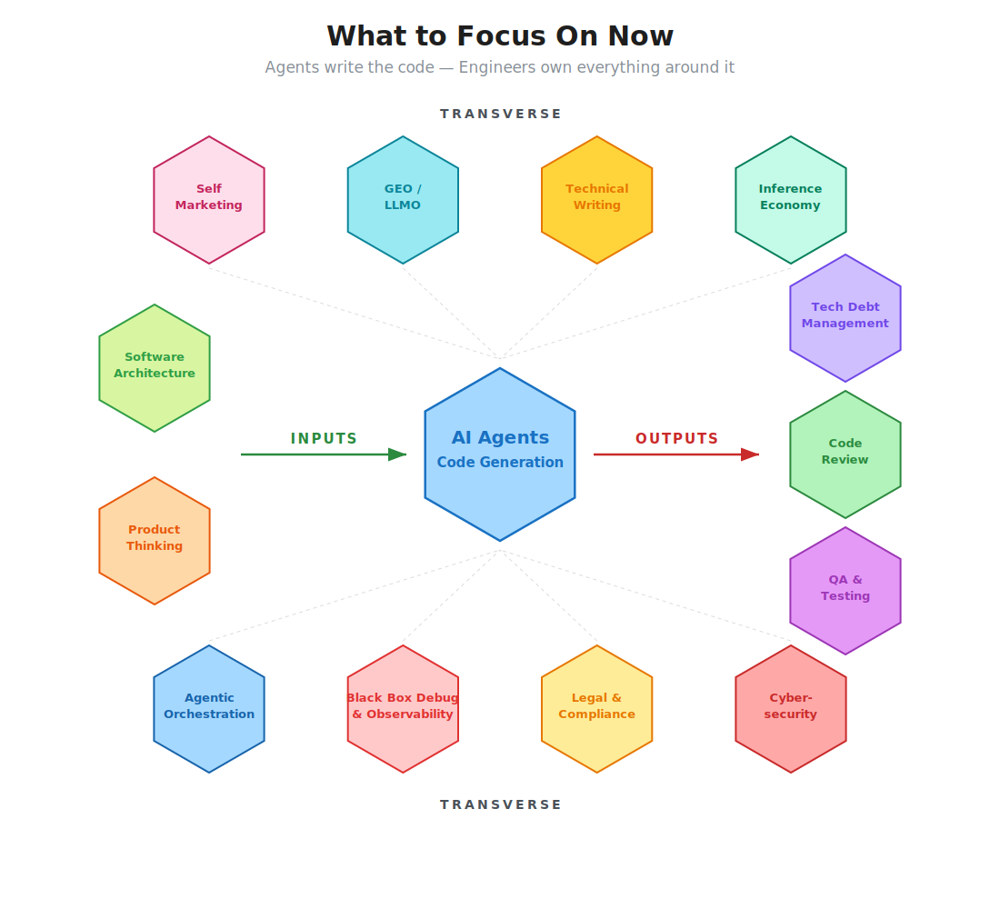

# 🔭 AI Watchtower

A curated tech radar for AI/LLM tooling, best practices, and news. One place to track the fast-moving landscape of AI agents, code assistants, frameworks, and developer culture.

📌 = Unread

---

## 🎯 What to Focus On Now

With 80%+ of code now AI-generated, the engineer's value shifts from writing code to shaping what gets built, how it holds together, and whether it works.

  

**Inputs — What you shape before the agent writes code:**

- [Software Architecture](#software-architecture) — System design, boundaries, and trade-offs don't prompt themselves
- [Product Thinking](#product-thinking) — Own the "what" and "why" before the agent writes the "how"

**Outputs — What you verify after the agent writes code:**

- [Technical Debt Management](#technical-debt-management) — AI writes fast, but someone has to maintain it
- [Code Review](#code-review) — The last line of defense is now the main job
- [QA & Testing Strategy](#qa--testing-strategy) — If you didn't write it, you'd better know how to break it

**Transverse — Skills that apply across the entire lifecycle:**

- [Self Marketing](#self-marketing) — Build visibility on LinkedIn, Twitter/X, Slack, and beyond — your work won't speak for itself
- [GEO / LLMO](#geo--llmo) — Marketing outcomes where AI models can find them
- [Technical Writing & Prompt Engineering](#technical-writing--prompt-engineering) — Specs, prompts, and docs are the new source code
- [Inference Economy](#inference-economy) — Save tokens, use simple scripts or local SLMs when a frontier model isn't needed
- [Agentic Orchestration](#agentic-orchestration) — Designing, chaining, and supervising AI agents (see below 👇)
- [Black Box Debug & Observability](#black-box-debug--observability) — You can't debug what you can't see; instrument what agents produce
- [Legal, Compliance & Governance](#legal-compliance--governance) — GDPR, AI Act, licensing — the rules AI can't learn on its own
- [Cybersecurity](#cybersecurity) — AI-generated code is only as secure as the reviewer

**⚠️ Bottlenecks — Where the pipeline stalls:**

- **Upstream:** Product must feed the backlog with clear business needs and prioritized requests — without this, agents spin on low-value work. FOMO-driven adoption ("competitors are shipping faster") compounds the problem by flooding the pipeline with half-baked specs.
- **Downstream:** The human review layer can't scale at the same pace as AI output. Code review and QA fatigue set in fast. It's hard to say "stop" to agentic work at end of day. Constant context switching erodes focus, developers lose meaning in the work, and the risk of burnout becomes real.

The radar below tracks the tools and practices for each of these areas.

---

## 📚 Table of Contents

- [What to Focus On Now](#what-to-focus-on-now)
- **Inputs**
  - [Software Architecture](#software-architecture)
  - [Product Thinking](#product-thinking)
- **Outputs**
  - [Technical Debt Management](#technical-debt-management)
  - [Code Review](#code-review)
  - [QA & Testing Strategy](#qa--testing-strategy)
- **Transverse**
  - [Self Marketing](#self-marketing)
  - [GEO / LLMO](#geo--llmo)
  - [Technical Writing & Prompt Engineering](#technical-writing--prompt-engineering)
  - [Inference Economy](#inference-economy)
  - [Agentic Orchestration](#agentic-orchestration)
  - [Black Box Debug & Observability](#black-box-debug--observability)
  - [Legal, Compliance & Governance](#legal-compliance--governance)
  - [Cybersecurity](#cybersecurity)
- **More**
  - [Language Ecosystems](#language-ecosystems)
  - [Data Engineering & Science](#data-engineering--science)
  - [Generative AI Patterns & Learning](#generative-ai-patterns--learning)
  - [Developer Tooling & Infrastructure](#developer-tooling--infrastructure)
  - [AI Native Landscape](#ai-native-landscape)
  - [Psychology, Culture & AI](#psychology-culture--ai)

---

## 🏗️ Software Architecture

System design, boundaries, and trade-offs don't prompt themselves.

- [Software Architect Roadmap](https://roadmap.sh/software-architect) — Roadmap for software architects

---

## 💡 Product Thinking

Own the "what" and "why" before the agent writes the "how".

- [Product Manager Roadmap](https://roadmap.sh/product-manager) — Roadmap for product managers

---

## 🧹 Technical Debt Management

AI writes fast, but someone has to maintain it.

- [How AI-Generated Code Accelerates Technical Debt](https://leaddev.com/technical-direction/how-ai-generated-code-accelerates-technical-debt) — LeadDev on the debt acceleration problem

---

## 👁️ Code Review

The last line of defense is now the main job.

- [Google's Code Review Practices](https://google.github.io/eng-practices/review/) — Engineering best practices for code review

---

## 🧪 QA & Testing Strategy

If you didn't write it, you'd better know how to break it.

- [QA Roadmap](https://roadmap.sh/qa) — Roadmap for QA engineers

---

## 📣 Self Marketing

Build visibility on LinkedIn, Twitter/X, Slack, and beyond — your work won't speak for itself.

- [Personal Branding for Devs](https://www.freecodecamp.org/news/personal-branding-for-devs-handbook/) — freeCodeCamp handbook on developer personal branding

---

## 🌐 GEO / LLMO

Generative Engine Optimization — making your content discoverable by AI models.

- [What is GEO/LLMO?](https://www.crews-education.com/actualites/qu-est-ce-que-le-geo-llmo) — Introduction to Generative Engine Optimization
- [8 On-Page SEO Tips for LLM/GEO](https://www.sebastien-vallat.com/8-conseils-seo-on-page-llm-geo/) — Practical optimization tips

---

## 📝 Technical Writing & Prompt Engineering

Specs, prompts, and docs are the new source code — prompt-driven and spec-driven development.

- [Prompting Guide](https://www.promptingguide.ai/fr) — Comprehensive prompt engineering guide
- [Prompting Guide: Basics](https://www.promptingguide.ai/fr/introduction/basics) — Introduction to prompt fundamentals
- [Prompt Driven Development](https://promptdriven.ai/) — PDD methodology 📌 Unread
- [Spec-Driven Development: Tools](https://martinfowler.com/articles/exploring-gen-ai/sdd-3-tools.html) — Martin Fowler on SDD tooling 📌 Unread
- [Humans and Agents](https://martinfowler.com/articles/exploring-gen-ai/humans-and-agents.html) — Martin Fowler on human-agent collaboration 📌 Unread
- [Knowledge Priming](https://martinfowler.com/articles/reduce-friction-ai/knowledge-priming.html) — Reducing friction with AI through knowledge priming
- [Skills.sh](https://skills.sh/) — Reusable AI skills marketplace
- [Math Spec-Driven Skill](https://github.com/Ben8t/math-spec-driven-skill) — Example of spec-driven skill development
- [CLI-Anything](https://github.com/HKUDS/CLI-Anything) — Turn any tool into a CLI for AI agents

---

## 💰 Inference Economy

[Save tokens](https://epoch.ai/blog/inference-economics-of-language-models), use simple scripts or local SLMs when a frontier model isn't needed. Optimize cost, latency, and routing across models.

### Token Optimization

- [RTK](https://github.com/rtk-ai/rtk) — Token reduction tool (standalone Rust binary, zero dependencies)
- [Claudette](https://github.com/nicmarti/Claudette) — Token reduction via MCP
- [Serena](https://github.com/oraios/serena) — Language-server-powered code intelligence MCP, gives agents precise context to save tokens 📌 Unread

### Multi-LLM Access & Routing

- [LiteLLM](https://github.com/BerriAI/litellm) — Unified API for 100+ LLMs
- [OpenRouter](https://openrouter.ai/) — LLM routing and access
- [1min AI](https://1min.ai/) — Multi-model AI access platform
- [LLMFit](https://github.com/AlexsJones/llmfit) — Find which models & providers run on your hardware 📌 Unread

---

## 🤖 Agentic Orchestration

Designing, chaining, and supervising AI agents — platforms, protocols, and tools.

### Agents & Frameworks

- [Building Effective Agents](https://www.anthropic.com/engineering/building-effective-agents) — Anthropic's guide to agent design
- [HuggingFace Agents Course](https://huggingface.co/learn/agents-course/unit0/introduction) — Free course on building AI agents
- [A2A: A New Era of Agent Interoperability](https://developers.googleblog.com/en/a2a-a-new-era-of-agent-interoperability/) — Google's Agent-to-Agent protocol
- [Automate 90% of Your Work with AI Agents](https://dev.to/copilotkit/automate-90-of-your-work-with-ai-agents-real-examples-code-inside-46ke?ref=dailydev) — Practical examples with code
- [Malt: From AI Assistant to AI Agents](https://blog.malt.engineering/from-ai-assistant-to-ai-agents-malts-journey-in-building-ai-tools-for-internal-efficiency-9198b41fd7d1?gi=5e83657d5955) — Malt's journey building internal AI tools
- [Malt: Vector Database for Freelancer Recommendations](https://blog.malt.engineering/super-powering-our-freelancer-recommendation-system-using-a-vector-database-add643fcfd23)
- [MongoDB: AI Agents](https://www.mongodb.com/resources/basics/artificial-intelligence/ai-agents) — Fundamentals of AI agents
- [Awesome AI Tools](https://github.com/mahseema/awesome-ai-tools) — Curated list of AI tools
- [Agor](https://agor.live/) — Multi-agent collaboration platform (by the creator of Airflow)
- [BMAD Method](https://github.com/bmad-code-org/BMAD-METHOD) — Breakthrough Method for Agile AI Development
- [Goose](https://github.com/block/goose) — Block's open-source AI developer agent
- [Beads](https://github.com/steveyegge/beads) — AI coding assistant framework by Steve Yegge 📌 Unread
- [Dexter](https://github.com/virattt/dexter) — Finance-focused AI agent
- [Kestra Engineering AI Hub](https://github.com/kestra-io/engineering-ai-hub) — AI-powered engineering workflows
- [Zvec](https://github.com/alibaba/zvec) — Vector database by Alibaba
- [Kilo AI](https://kilo.ai/) — AI agent platform
- [VibeKanban](https://www.vibekanban.com/) — AI-native project management 📌 Unread
- [Everything Claude Code](https://github.com/affaan-m/everything-claude-code) — Curated resources for Claude Code
- [OpenClaw](https://openclaw.ai/) — Open-source AI agent framework
- [NanoClaw](https://nanoclaw.net/) — Lightweight agent runtime
- [NemoClaw](https://github.com/NVIDIA/NemoClaw) — NVIDIA's agent framework
- [Sim AI](https://www.sim.ai/) — Create agents, MCP servers, and tools visually
- [Causal AI: From What to Why](https://elaiapartners.substack.com/p/from-what-to-why-the-rise-of-causal) — The rise of causal AI
- [Aden HQ](https://adenhq.com/) — AI-powered development platform
- [Cosine](https://cosine.sh/) — AI code companion
- [Entire](https://entire.io/) — AI development platform
- [Air.dev](https://air.dev/) — AI agent builder
- [GitHub Agentic Workflows](https://github.com/features) — GitHub's built-in agentic capabilities
- [Get Shit Done](https://github.com/gsd-build/get-shit-done) — Pragmatic AI development methodology 📌 Unread
- [Autopsy of the Great Reckoning](https://www.linkedin.com/pulse/autopsie-du-great-reckoning-et-les-5-le%C3%A7ons-qui-lia-aur%C3%A9lien-allienne-tpkue/) — 5 lessons from AI adoption
- [UCP: Universal Commerce Protocol](https://developers.googleblog.com/under-the-hood-universal-commerce-protocol-ucp/) — Google's Universal Commerce Protocol

### MCP (Model Context Protocol)

The open standard for connecting AI models to external tools and data sources.

- [MCP Introduction](https://modelcontextprotocol.io/introduction) — Official documentation
- [Spring AI & MCP](https://www.baeldung.com/spring-ai-model-context-protocol-mcp) — Integrating MCP with Spring AI
- [MCP Servers Explained](https://generativeai.pub/mcp-servers-explained-python-and-agentic-ai-tool-integration-aa2ddca6cbe5) — Python and agentic AI tool integration
- [MCP Part I: Core Concepts](https://blog.owulveryck.info/fr/2025/01/27/mcp-partie-i-concepts-fondamentaux-pass%C3%A9-pr%C3%A9sent-et-futur-des-syst%C3%A8mes-agents.html) — Past, present, and future of agent systems
- [Awesome MCP Servers](https://glama.ai/mcp/servers) — Directory of MCP servers
- [MCP is Dead, Long Live the CLI](https://ejholmes.github.io/2026/02/28/mcp-is-dead-long-live-the-cli.html) — The debate: MCP vs CLI tools (nuance: MCPs cost more tokens for tool calls; skills & CLI can be more efficient, but MCPs still have valid use cases)
- [Datagouv MCP](https://github.com/datagouv/datagouv-mcp) — French open data MCP server
- [Micronaut MCP](https://micronaut-projects.github.io/micronaut-mcp/snapshot/guide/) — MCP support for Micronaut framework

### Claude Code

Best practices, monitoring, and plugins for Claude Code.

- [Claude Code Best Practices (Thread 1)](https://x.com/bcherny/status/2007179832300581177) — Tips from a Claude engineer 📌 Unread
- [Claude Code Best Practices (Thread 2)](https://x.com/bcherny/status/2017742741636321619) — More tips from a Claude engineer 📌 Unread
- [Claude Code Best Practices Repo](https://github.com/shanraisshan/claude-code-best-practice) — Community-curated best practices 📌 Unread
- [Claude Code Tips](https://github.com/ykdojo/claude-code-tips) — Practical tips collection 📌 Unread
- [Claude Code Guide](https://cc.bruniaux.com/guide/) — Comprehensive guide 📌 Unread
- [MCP vs CLI Guidance](https://cc.bruniaux.com/guide/mcp-vs-cli/#guidance-by-situation) — When to use MCP vs CLI 📌 Unread
- [Claude Code Diagrams](https://cc.bruniaux.com/diagrams/) — Visual architecture diagrams 📌 Unread
- [Claude Code in Action](https://anthropic.skilljar.com/claude-code-in-action) — Official Anthropic training 📌 Unread
- [Claude Code Plugins](https://code.claude.com/docs/en/plugins) — Official plugins documentation 📌 Unread
- [Claude Swarm Monitor](https://github.com/oinant/claude-swarm-monitor) — Monitor Claude Code swarms
- [Claude Octopus](https://github.com/nyldn/claude-octopus) — Multi-agent orchestrator coordinating Claude, Codex, and Gemini CLIs 📌 Unread
- [CC Workflow Studio](https://github.com/breaking-brake/cc-wf-studio) — Claude Code observability
- [Ralph Claude Code](https://github.com/frankbria/ralph-claude-code) — Claude Code assistant 📌 Unread
- [ExitBox](https://github.com/Cloud-Exit/ExitBox) — Security sandbox for Claude Code
- [AI-RSK](https://github.com/Krigsexe/ai-rsk) — Security gate for AI-generated code, blocks builds until vulnerabilities are fixed
- [Claude Opus 4.6 Announcement](https://www.anthropic.com/news/claude-opus-4-6) — Latest model release 📌 Unread
- [Claude Sonnet 4.6 Announcement](https://www.anthropic.com/news/claude-sonnet-4-6) — Latest model release 📌 Unread
- [COBOL Modernization with AI](https://claude.com/blog/how-ai-helps-break-cost-barrier-cobol-modernization) — Breaking the cost barrier 📌 Unread
- [Claude Certified Architect](https://anthropic.skilljar.com/claude-certified-architect-foundations-access-request) — Certification for Claude partners
- [Claude Certified Architect Study Guide](https://github.com/paullarionov/claude-certified-architect/blob/main/guide_en.MD) — Community study guide 📌 Unread

#### Plugins

- [Context7](https://github.com/upstash/context7) — Up-to-date docs and code examples for any library, pulled straight into your prompt 📌 Unread
- [Superpowers](https://github.com/obra/superpowers) — Agentic skills framework & software development methodology 📌 Unread
- [Hookify](https://github.com/anthropics/claude-code/tree/main/plugins/hookify) — Official plugin to manage Claude Code hooks visually 📌 Unread

### Code Assistants & AI Editors

IDEs, copilots, and AI-powered coding tools.

- [Best AI Code Editors (2025)](https://www.builder.io/blog/best-ai-code-editors?ref=dailydev) — Comprehensive comparison
- [Claude AI](https://claude.ai) — Anthropic's AI assistant
- [Cursor](https://www.cursor.com) — AI-first code editor
- [Continue](https://www.continue.dev/) — Open-source AI code assistant
- [Continue + Ollama](https://ollama.com/blog/continue-code-assistant) — Running Continue with local models
- [Supermaven](https://supermaven.com/) — Fast AI code completion
- [DevoxxGenie](https://github.com/devoxx/DevoxxGenieIDEAPlugin) — AI plugin for IntelliJ IDEA
- [Junie](https://www.jetbrains.com/junie/) — JetBrains' AI coding agent
- [Lovable](https://lovable.dev) — AI-powered full-stack app builder
- [Mammouth AI](https://mammouth.ai/) — AI coding assistant
- [Figma to Code](https://www.figma.com/community/plugin/747985167520967365) — Convert Figma designs to code
- [OpenCode](https://opencode.ai/) — Open-source AI coding platform 📌 Unread
- [OpenCode Worktree](https://github.com/kdcokenny/opencode-worktree) — Worktree support (alternative: `claude --worktree feature-auth`) 📌 Unread
- [OCX](https://github.com/kdcokenny/ocx) — Extends OpenCode capabilities 📌 Unread

---

## 🔍 Black Box Debug & Observability

You can't debug what you can't see — instrument what agents produce.

- [AI Agent Observability](https://wandb.ai/site/articles/ai-agent-observability/) — Weights & Biases guide to agent observability

---

## ⚖️ Legal, Compliance & Governance

GDPR, AI Act, licensing — the rules AI can't learn on its own.

- [AI Act Explainer](https://linuxfoundation.eu/newsroom/ai-act-explainer) — Linux Foundation's EU AI Act explainer

---

## 🔒 Cybersecurity

AI-generated code is only as secure as the reviewer.

- [Cybersecurity Roadmap](https://roadmap.sh/cyber-security) — Roadmap for cybersecurity

---

## ☕🐍 Language Ecosystems

AI-era tooling and best practices for Java and Python.

### AI for Java

Spring AI, LangChain4J, and the Java AI ecosystem.

- [Spring AI](https://spring.io/projects/spring-ai) — Official Spring AI project
- [Spring AI Concepts](https://docs.spring.io/spring-ai/reference/concepts.html) — Core concepts documentation
- [Spring AI Prompt Engineering Patterns](https://spring.io/blog/2025/04/14/spring-ai-prompt-engineering-patterns) — Prompt patterns for Spring AI
- [LangChain4J](https://docs.langchain4j.dev/) — Java LLM framework documentation
- [LangChain4J + Docker Model Runner](https://medium.com/@lize.raes/langchain4j-%EF%B8%8F-docker-model-runner-b5f720a76c85) — Running LangChain4J with Docker
- [Evolution of the Java Ecosystem for AI](https://inside.java/2025/01/29/evolution-of-java-ecosystem-for-integrating-ai/) — Oracle's perspective on Java + AI
- [Koog for Java](https://blog.jetbrains.com/ai/2026/03/koog-comes-to-java/) — JetBrains' AI framework for Java 📌 Unread

### Python Ecosystem

Python fundamentals, frameworks, and best practices for the AI-era developer.

#### Core Python

- [PEP 8 — Style Guide](https://peps.python.org/pep-0008/) — The official Python style guide
- [Python Standard Library](https://docs.python.org/3/library/) — Complete standard library reference
- [Virtual Environments (venv)](https://docs.python.org/3/library/venv.html) — Managing Python environments
- [Classes & Namespaces](https://docs.python.org/3/tutorial/classes.html#python-scopes-and-namespaces) — Scopes and namespaces tutorial
- [Dunder Methods](https://gayerie.dev/docs/python/python3/dunder.html) — Guide to Python magic methods
- [Abstract Base Classes (abc)](https://docs.python.org/fr/3.13/library/abc.html) — ABC module reference
- [AsyncIO](https://docs.python.org/fr/3.13/library/asyncio.html) — Asynchronous I/O reference
- [Dataclasses](https://invivoo.com/blog/dataclasses-python) — Practical guide to dataclasses
- [Dependency Injection Best Practices](https://arjancodes.com/blog/python-dependency-injection-best-practices/) — DI patterns in Python
- [DDD with Python Microservices](https://medium.com/@nomannayeem/everything-you-need-to-know-about-domain-driven-design-with-python-microservices-2c2f6556b5b1) — Domain-Driven Design guide
- [Is Python Really That Slow?](https://blog.miguelgrinberg.com/post/is-python-really-that-slow) — Performance myths debunked
- [Python Is Slow and Other Myths](https://hackernoon.com/python-is-slow-and-other-myths-of-a-dying-era) — More performance myth-busting
- **Fluent Python** (book) — Deep dive into Pythonic code

#### Web Frameworks

- [Flask Quickstart](https://flask.palletsprojects.com/en/stable/quickstart/) — Getting started with Flask
- [Flask Blueprints](https://flask.palletsprojects.com/en/stable/blueprints/) — Modular Flask applications
- [Flask + Jinja2 to React](https://dev.to/usooldatascience/transitioning-from-flask-with-jinja2-to-react-understanding-authentication-and-data-flow-for-4214) — Migration guide
- [FastAPI Tutorial](https://fastapi.tiangolo.com/tutorial/) — Getting started with FastAPI
- [Pydantic Docs](https://docs.pydantic.dev/latest/) — Data validation library

---

## 🗄️ Data Engineering & Science

Roadmaps, machine learning, and data career paths.

### Roadmaps

- [Data Engineer Roadmap](https://roadmap.sh/data-engineer)
- [Data Analyst Roadmap](https://roadmap.sh/data-analyst)
- [SQL Roadmap](https://roadmap.sh/sql)
- [Machine Learning Roadmap](https://roadmap.sh/machine-learning)
- [AI Data Scientist Roadmap](https://roadmap.sh/ai-data-scientist)
- [AI Engineer Roadmap](https://roadmap.sh/ai-engineer)
- [AI Agents Roadmap](https://roadmap.sh/ai-agents)
- [MLOps Roadmap](https://roadmap.sh/mlops)

### Learning

- [Clean & Analyze Your Dataset](https://openclassrooms.com/fr/courses/7410486-nettoyez-et-analysez-votre-jeu-de-donnees) — OpenClassrooms data cleaning course
- **Essential Math for Data Science** (book) — Mathematical foundations
- **Tools**: Jupyter Notebook, Kaggle, Hugging Face, Matplotlib, NumPy, Pandas

---

## 🧠 Generative AI Patterns & Learning

Architecture patterns, training resources, and foundational learning.

- [Generative AI Patterns](https://martinfowler.com/articles/gen-ai-patterns/) — Martin Fowler's gen AI pattern catalog
- [Legacy Modernization with Gen AI](https://martinfowler.com/articles/legacy-modernization-gen-ai.html) — Modernizing legacy systems
- [12 Days of Free Gen AI Training](https://cloud.google.com/blog/topics/training-certifications/12-days-of-no-cost-generative-ai-training?hl=en) — Google Cloud free training
- [A Field Guide to AI](https://hamel.dev/blog/posts/field-guide/) — Practical AI field guide
- [HuggingFace](https://huggingface.co) — The open-source AI platform

---

## 🔧 Developer Tooling & Infrastructure

Docker, terminals, browser automation, and other tools for AI-augmented workflows.

### Docker & Infrastructure

- [Docker Model Runner](https://www.docker.com/blog/introducing-docker-model-runner/) — Run AI models directly in Docker

### Terminal Tools

- [Warp](https://www.warp.dev/) — AI-powered terminal
- [Zellij](https://github.com/zellij-org/zellij) — Modern terminal workspace (Rust)
- [tmux](https://github.com/tmux/tmux) — Classic terminal multiplexer

### Browser Automation & Misc

- [Scrapling](https://github.com/D4Vinci/Scrapling) — AI-adapted web scraping
- [Trigger.dev](https://trigger.dev/) — Background jobs and workflow automation
- [Agent Browser](https://agent-browser.dev/skills) — Browser automation CLI for AI agents
- [Vercel Agent Browser](https://github.com/vercel-labs/agent-browser) — Vercel's browser automation skills

---

## 🧭 AI Native Landscape

Overview of the AI-native development ecosystem.

- [AI Native Dev Landscape](https://landscape.ainativedev.io/) — Interactive landscape of AI-native tools

---

## 💭 Psychology, Culture & AI

Thought pieces on how AI is reshaping developer culture and the software industry.

- [The AI Vampire](https://steve-yegge.medium.com/the-ai-vampire-eda6e4f07163) — Steve Yegge on AI's impact
- [The Post-Developer Era](https://www.joshwcomeau.com/blog/the-post-developer-era/) — What comes after traditional development
- [The Recurring Dream of Replacing Developers](https://www.caimito.net/en/blog/2025/12/07/the-recurring-dream-of-replacing-developers.html) — Historical perspective
- [AI Theater vs AI Fluency](https://www.atlassian.com/blog/artificial-intelligence/ai-theater-vs-ai-fluency-the-sneaky-patterns-that-hold-back-ai-results/amp) — Atlassian on real vs. performative AI adoption
- [The Next Software Crisis Won't Be About Writing Code](https://blog.kotzilla.io/the-next-software-crisis-wont-be-about-writing-code)
- [So I Will Never Write Code Again?](https://julien.danjou.info/blog/so-i-will-never-write-code-again/) — A developer's reflection
- [Enterprise AI](https://www.latent.space/p/enterprise) — Latent Space on enterprise AI adoption
- [AI Agent Attacks Open Source Developer](https://intelligence-artificielle.developpez.com/actu/380270/Un-agent-IA-autonome-lance-une-campagne-de-denigrement-contre-un-developpeur-open-source-pour-imposer-son-optimisation-a-la-bibliotheque-Python-Matplotlib-que-ce-dernier-a-refusee/) — When an autonomous AI agent targeted an open-source maintainer
- [Death by Clawd](https://deathbyclawd.com/) — Ironical SaaS death prediction powered by AI 📌 Unread
